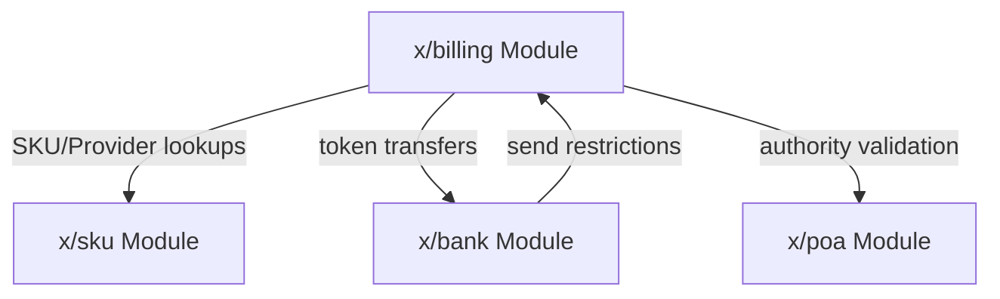
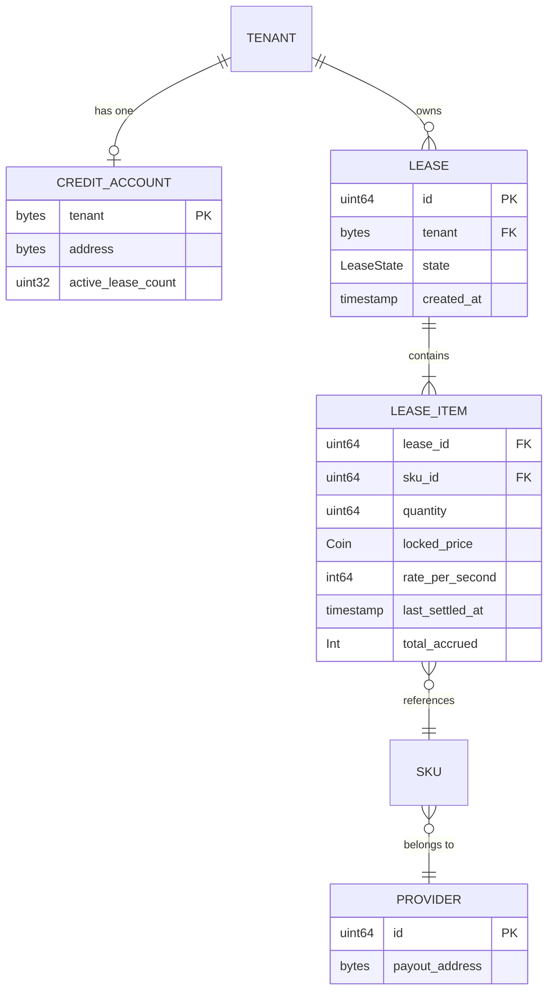
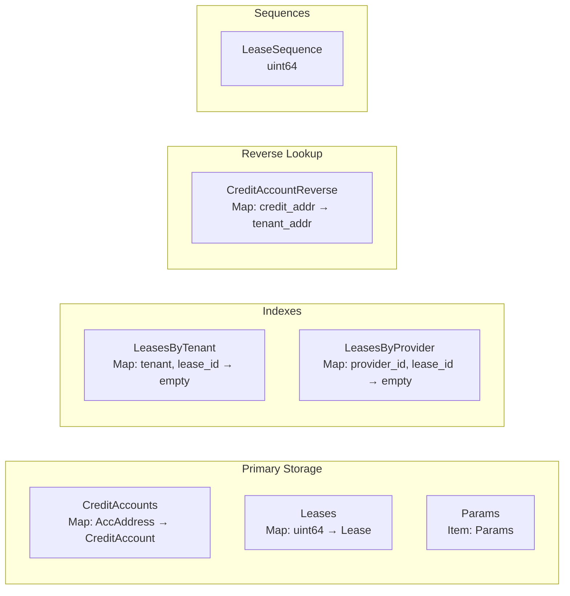
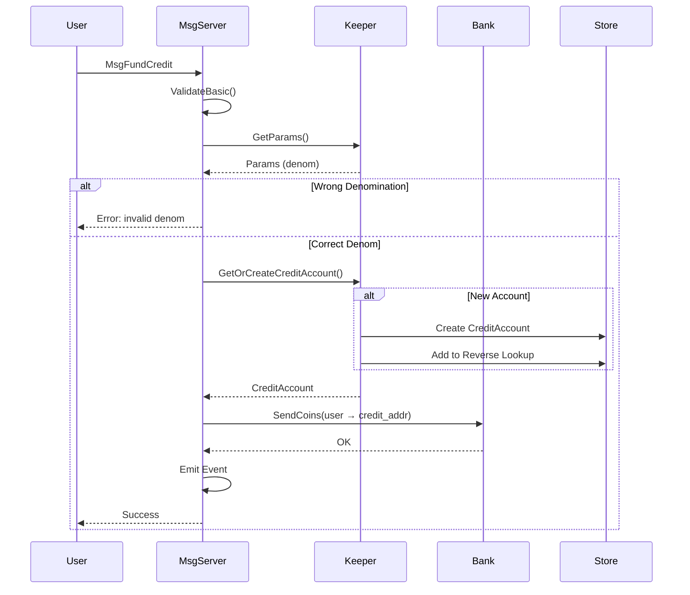
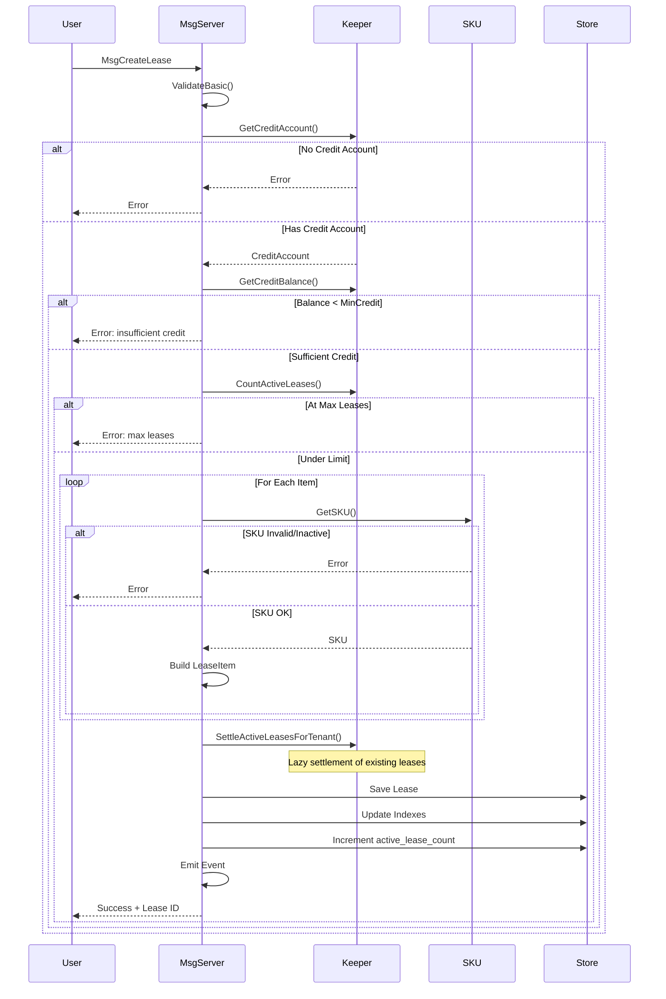
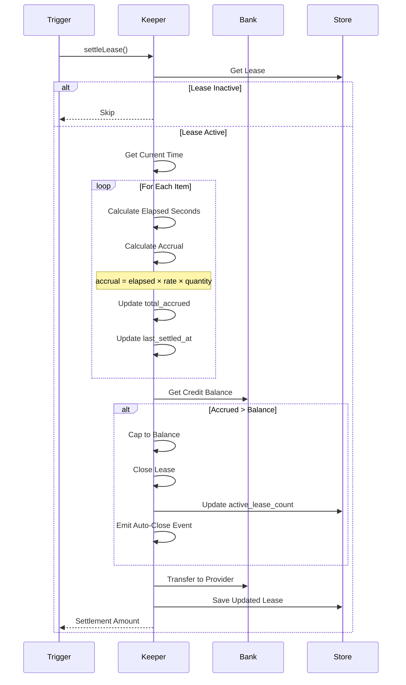
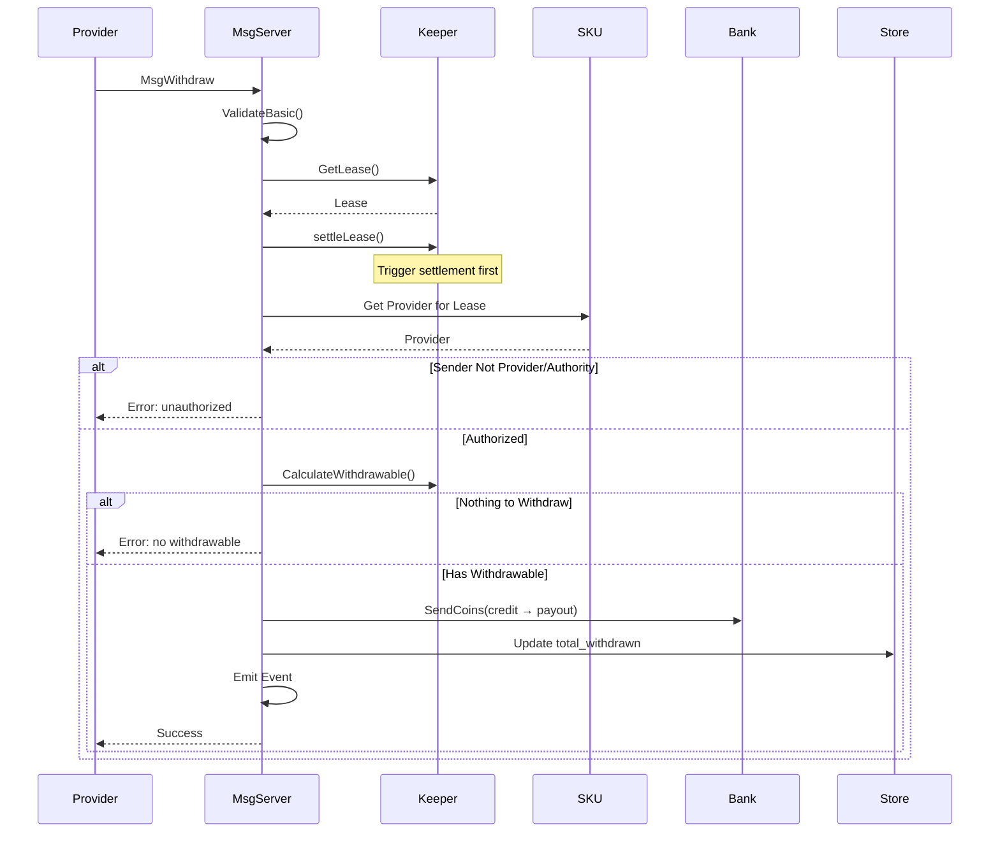
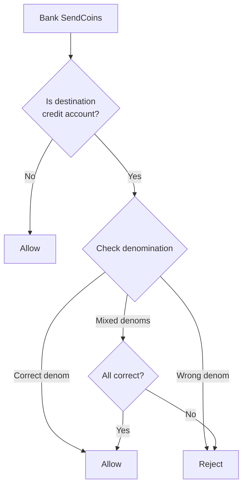

# Billing Module Architecture

This document describes the internal architecture of the x/billing module for developers who need to understand, maintain, or extend the module.

## Overview

The Billing module implements a cloud-like billing system where tenants lease resources (SKUs) and are charged from a pre-funded credit account. It provides lazy evaluation of charges, automatic lease closure when funds are exhausted, and provider withdrawals.

## Module Dependencies



The Billing module:
- **Depends on**: 
  - `x/sku` for SKU and Provider information
  - `x/bank` for token transfers
  - `x/poa` for authority validation
- **Provides to**: `x/bank` send restriction for credit accounts

## Data Model

### Entity Relationship Diagram



### CreditAccount

Credit accounts hold pre-funded tokens for lease payments:

| Field | Type | Description |
|-------|------|-------------|
| `tenant` | `bytes` | Tenant's original address (primary key) |
| `address` | `bytes` | Derived credit account address |
| `active_lease_count` | `uint32` | Number of active leases (for O(1) count) |

**Address Derivation:**
```go
creditAddr = sha256("billing" + tenantAddr)[:20]
```

### Lease

Leases represent active or closed resource rentals:

| Field | Type | Description |
|-------|------|-------------|
| `id` | `uint64` | Auto-incremented unique identifier |
| `tenant` | `bytes` | Tenant address |
| `state` | `LeaseState` | ACTIVE or INACTIVE |
| `created_at` | `Timestamp` | When lease was created |

### LeaseItem

Individual line items within a lease:

| Field | Type | Description |
|-------|------|-------------|
| `sku_id` | `uint64` | Reference to SKU |
| `quantity` | `uint64` | Number of units (e.g., 5 instances) |
| `locked_price` | `Coin` | Price locked at lease creation |
| `rate_per_second` | `int64` | Pre-computed per-second cost |
| `last_settled_at` | `Timestamp` | Last settlement time |
| `total_accrued` | `Int` | Total amount accrued |

### LeaseState Enum

```
LEASE_STATE_UNSPECIFIED = 0  // Invalid
LEASE_STATE_ACTIVE      = 1  // Currently billing
LEASE_STATE_INACTIVE    = 2  // Closed
```

## Storage Layout

### Collections



| Collection | Key Type | Value Type | Purpose |
|------------|----------|------------|---------|
| `CreditAccounts` | `sdk.AccAddress` | `CreditAccount` | Credit account storage |
| `CreditAccountReverse` | `sdk.AccAddress` | `sdk.AccAddress` | O(1) credit account detection |
| `Leases` | `uint64` | `Lease` | Primary lease storage |
| `LeaseSequence` | - | `uint64` | Auto-increment for lease IDs |
| `LeasesByTenant` | `(AccAddress, uint64)` | `bool` | Tenant → leases index |
| `LeasesByProvider` | `(uint64, uint64)` | `bool` | Provider → leases index |
| `Params` | - | `Params` | Module parameters |

## Core Flows

### Fund Credit Account



### Create Lease



### Settlement (Lazy Evaluation)



### Withdrawal Flow



## Settlement Triggers

Settlement happens lazily at these points:

| Trigger | Scope | Reason |
|---------|-------|--------|
| `CloseLease` | Target lease only | Final settlement + auto-close check |
| `Withdraw` | Target lease only | Calculate withdrawable + auto-close check |
| `WithdrawAll` | All provider's leases | Batch settlement |

**Note**: Query operations do NOT trigger settlement or auto-close. They return the stored state. Auto-close only happens during write operations to ensure state changes are properly committed to the blockchain.

## Send Restriction

The billing module registers a bank send restriction to protect credit accounts:



**Implementation:**
```go
func (k *Keeper) CreditAccountSendRestriction(
    ctx context.Context, 
    _, toAddr sdk.AccAddress, 
    amt sdk.Coins,
) (sdk.AccAddress, error) {
    if !k.isCreditAccountAddress(ctx, toAddr) {
        return toAddr, nil // Not a credit account, allow
    }
    
    params := k.GetParams(ctx)
    for _, coin := range amt {
        if coin.Denom != params.Denom {
            return toAddr, ErrInvalidDenomination
        }
    }
    return toAddr, nil
}
```

## Accrual Calculation

### Per-Second Rate

```
rate_per_second = (base_price.Amount / unit.Seconds()) × quantity
```

### Accrual Formula

```
elapsed_seconds = current_time - last_settled_at
accrual = elapsed_seconds × rate_per_second
```

### Example

SKU: 3600umfx per hour (1 per second)
Quantity: 5 instances
Elapsed: 100 seconds

```
rate = (3600 / 3600) × 5 = 5 per second
accrual = 100 × 5 = 500umfx
```

## Parameters

| Parameter | Type | Default | Description |
|-----------|------|---------|-------------|
| `denom` | `string` | PWR factory denom | Accepted credit denomination |
| `max_leases_per_tenant` | `uint64` | 100 | Max active leases per tenant |
| `max_items_per_lease` | `uint64` | 20 | Max items in single lease |
| `min_lease_duration` | `uint64` | 3600 | Minimum seconds of credit required to create a lease |
| `allowed_list` | `[]string` | `[]` | Addresses that can create leases for tenants |

**Note**: `WithdrawAll` limits are enforced via constants, not parameters:
- Default limit: 50 leases per call
- Maximum limit: 100 leases per call

## Events

| Event | Key Attributes | When Emitted |
|-------|----------------|--------------|
| `credit_funded` | `tenant`, `amount` | Credit account funded |
| `lease_created` | `lease_id`, `tenant`, `items`, `created_by` | New lease created |
| `lease_closed` | `lease_id`, `tenant`, `reason`, `total_accrued` | Lease closed |
| `lease_auto_closed` | `lease_id`, `tenant`, `reason` | Auto-closed due to exhausted credit |
| `withdrawal` | `lease_id`, `provider_id`, `amount` | Provider withdrew funds |
| `settlement` | `lease_id`, `amount`, `new_total_accrued` | Lease settled |

## Error Codes

| Error | Code | Description |
|-------|------|-------------|
| `ErrCreditAccountNotFound` | 2 | Tenant has no credit account |
| `ErrInsufficientCredit` | 3 | Credit balance below minimum |
| `ErrLeaseNotFound` | 4 | Lease does not exist |
| `ErrLeaseNotActive` | 5 | Lease already closed |
| `ErrUnauthorized` | 6 | Sender not authorized |
| `ErrInvalidLease` | 7 | Lease validation failed |
| `ErrMaxLeasesReached` | 8 | Tenant at max leases |
| `ErrNoWithdrawable` | 9 | Nothing to withdraw |
| `ErrInvalidCredit` | 10 | Credit operation failed |
| `ErrSKUNotFound` | 11 | Referenced SKU not found |
| `ErrSKUInactive` | 12 | SKU is deactivated |
| `ErrInvalidDenomination` | 13 | Wrong token denomination |

## Security Considerations

### Authorization Matrix

| Operation | Tenant | Provider | Authority | Allow-Listed |
|-----------|--------|----------|-----------|--------------|
| FundCredit | ✓ (self) | ✗ | ✓ | ✗ |
| CreateLease | ✓ (self) | ✗ | ✗ | ✗ |
| CreateLeaseForTenant | ✗ | ✗ | ✓ | ✓ |
| CloseLease | ✓ (own) | ✓ (own SKU) | ✓ | ✗ |
| Withdraw | ✗ | ✓ (own) | ✓ | ✗ |
| WithdrawAll | ✗ | ✓ (own) | ✓ | ✗ |
| UpdateParams | ✗ | ✗ | ✓ | ✗ |

### Overflow Protection

```go
func safeCalculateAccrual(elapsedSeconds, ratePerSecond int64) (math.Int, error) {
    // Check for potential overflow
    if elapsedSeconds > 0 && ratePerSecond > math.MaxInt64/elapsedSeconds {
        return math.Int{}, ErrOverflow
    }
    return math.NewInt(elapsedSeconds).Mul(math.NewInt(ratePerSecond)), nil
}
```

### DoS Mitigations

1. **Max leases per tenant** - Prevents lease spam
2. **Max items per lease** - Limits computation per lease
3. **Withdrawal batch size** - Caps WithdrawAll iterations
4. **Lazy settlement** - No EndBlocker overhead
5. **Indexed lookups** - O(1) credit account detection

## Performance Characteristics

| Operation | Complexity | Notes |
|-----------|------------|-------|
| FundCredit | O(1) | Bank transfer + storage write |
| CreateLease | O(n×m) | n = active leases, m = items |
| CloseLease | O(m) | m = items in lease |
| Withdraw | O(m) | m = items in lease |
| WithdrawAll | O(k×m) | k = leases, m = avg items |
| GetCreditBalance | O(1) | Bank query |
| isCreditAccount | O(1) | Reverse lookup map |

## Testing Strategy

### Unit Tests
- Message validation
- Accrual calculations
- Settlement logic
- Send restrictions
- Authorization checks

### Integration Tests
- Full message flows
- Genesis import/export
- Parameter updates
- Multi-lease scenarios

### E2E Tests
- Complete billing cycle
- Auto-close mechanism
- Provider withdrawals
- Credit protection
- Error conditions

### Simulation
- Random operations
- Stress testing
- State consistency
