# Billing Module Architecture

This document describes the internal architecture of the x/billing module for developers who need to understand, maintain, or extend the module.

## Overview

The Billing module implements a cloud-like billing system where tenants lease resources (SKUs) and are charged from a pre-funded credit account. Key features:

- **PENDING → ACTIVE lifecycle**: Leases start in PENDING state and require provider acknowledgement before billing begins
- **UUIDv7 identifiers**: Providers, SKUs, and Leases use deterministic UUIDv7 for unique identification
- **Multi-denom support**: Different SKUs can use different payment tokens
- **Lazy settlement**: Charges are calculated on-demand during withdrawals/closures
- **Automatic expiration**: EndBlocker expires pending leases that exceed timeout

## Module Dependencies

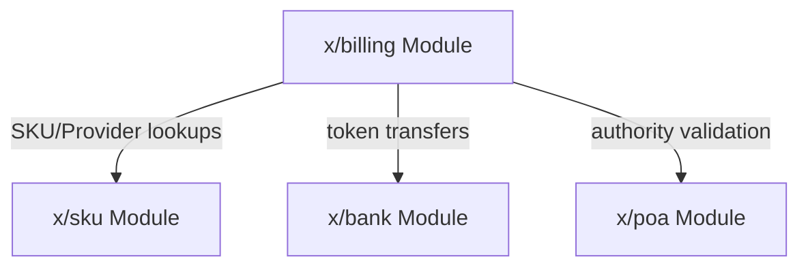

The Billing module:
- **Depends on**: 
  - `x/sku` for SKU and Provider information (UUIDs, prices, payout addresses)
  - `x/bank` for token transfers
  - `x/poa` for authority validation

## Data Model

### Entity Relationship Diagram

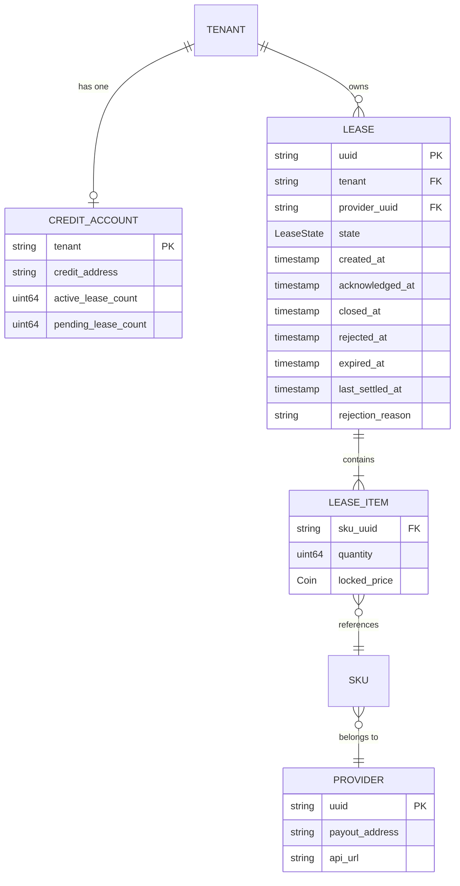

### CreditAccount

Credit accounts hold pre-funded tokens for lease payments:

| Field | Type | Description |
|-------|------|-------------|
| `tenant` | `string` | Tenant's original address (primary key) |
| `credit_address` | `string` | Derived credit account address |
| `active_lease_count` | `uint64` | Number of ACTIVE leases |
| `pending_lease_count` | `uint64` | Number of PENDING leases |

**Address Derivation:**
```go
creditAddr = sha256("billing" + tenantAddr)[:20]
```

### Lease

Leases represent resource rentals with full lifecycle tracking:

| Field | Type | Description |
|-------|------|-------------|
| `uuid` | `string` | UUIDv7 unique identifier |
| `tenant` | `string` | Tenant address |
| `provider_uuid` | `string` | Provider UUID (denormalized for efficient querying) |
| `items` | `[]LeaseItem` | List of SKU items in this lease |
| `state` | `LeaseState` | PENDING, ACTIVE, CLOSED, REJECTED, or EXPIRED |
| `created_at` | `Timestamp` | When lease was created (credit locked) |
| `acknowledged_at` | `*Timestamp` | When provider acknowledged (billing starts) |
| `closed_at` | `*Timestamp` | When lease was closed |
| `rejected_at` | `*Timestamp` | When provider rejected |
| `expired_at` | `*Timestamp` | When lease expired in PENDING state |
| `last_settled_at` | `Timestamp` | Last settlement time for the entire lease |
| `rejection_reason` | `string` | Provider's rejection explanation (max 256 chars) |

### LeaseItem

Individual line items within a lease:

| Field | Type | Description |
|-------|------|-------------|
| `sku_uuid` | `string` | Reference to SKU (UUIDv7) |
| `quantity` | `uint64` | Number of units (e.g., 5 instances) |
| `locked_price` | `Coin` | Per-second price locked at lease creation (includes denom) |

**Note**: The `locked_price` is pre-computed at lease creation as the per-second rate for billing calculations. This is derived from the SKU's base price and unit at the time of lease creation. The denomination is preserved from the SKU's `base_price`, enabling multi-denom billing.

### LeaseState Enum

```
LEASE_STATE_UNSPECIFIED = 0  // Invalid
LEASE_STATE_PENDING     = 1  // Awaiting provider acknowledgement (credit locked, not billing)
LEASE_STATE_ACTIVE      = 2  // Provider acknowledged, billing active
LEASE_STATE_CLOSED      = 3  // Terminated normally
LEASE_STATE_REJECTED    = 4  // Provider rejected (credit unlocked)
LEASE_STATE_EXPIRED     = 5  // Pending timeout exceeded (credit unlocked)
```

## Storage Layout

### Collections

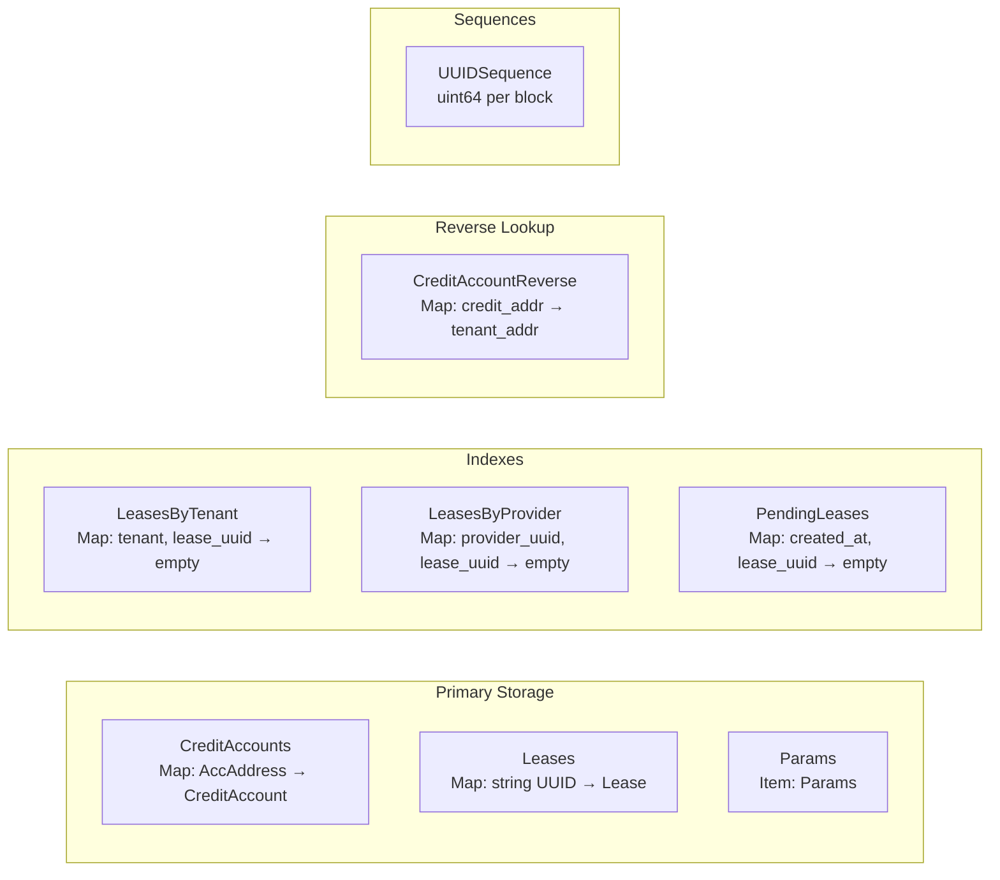

| Collection | Key Type | Value Type | Purpose |
|------------|----------|------------|---------|
| `CreditAccounts` | `sdk.AccAddress` | `CreditAccount` | Credit account storage |
| `CreditAccountReverse` | `sdk.AccAddress` | `sdk.AccAddress` | O(1) credit account detection |
| `Leases` | `string` (UUID) | `Lease` | Primary lease storage |
| `LeasesByTenant` | `(AccAddress, string)` | `bool` | Tenant → leases index |
| `LeasesByProvider` | `(string, string)` | `bool` | Provider UUID → leases index |
| `PendingLeases` | `(time, string)` | `bool` | Time-ordered pending lease index for EndBlocker |
| `Params` | - | `Params` | Module parameters |

## Core Flows

### Lease Lifecycle

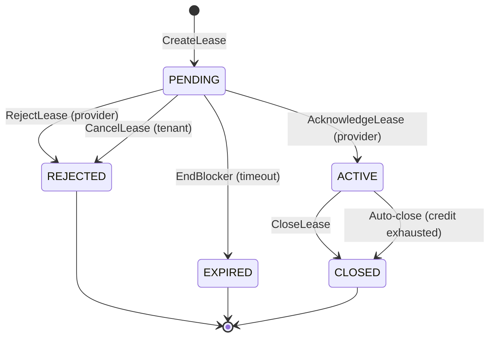

### Fund Credit Account

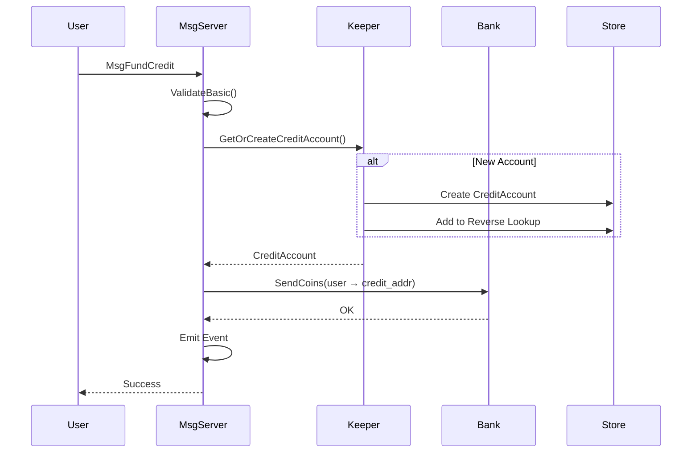

### Create Lease (PENDING State)

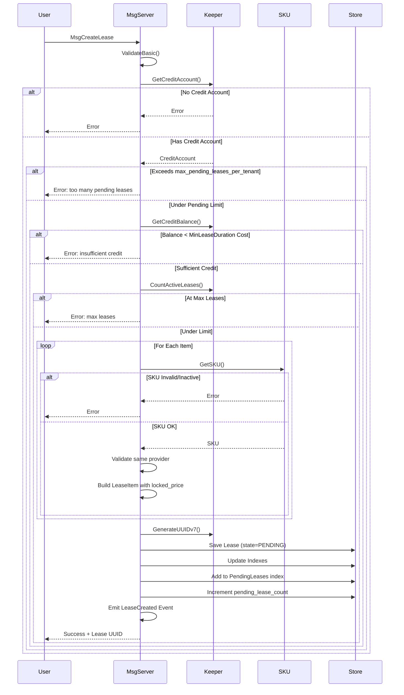

### Acknowledge Lease (PENDING → ACTIVE)

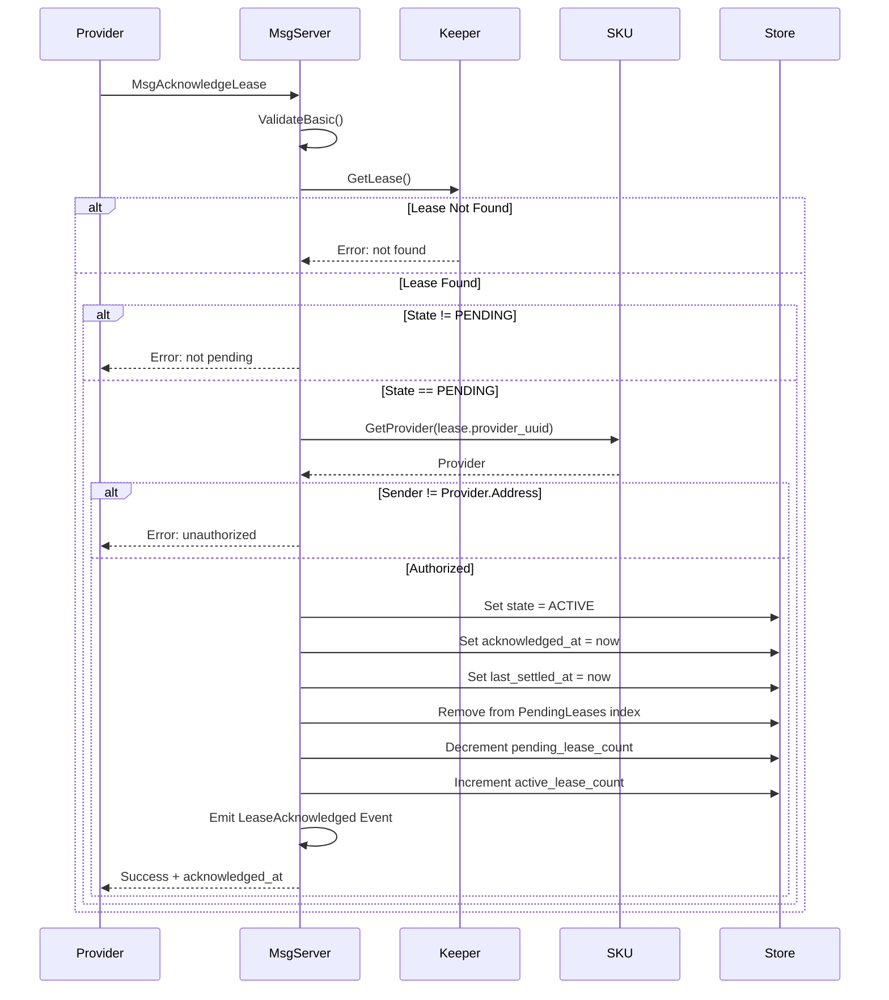

### Reject Lease (PENDING → REJECTED)

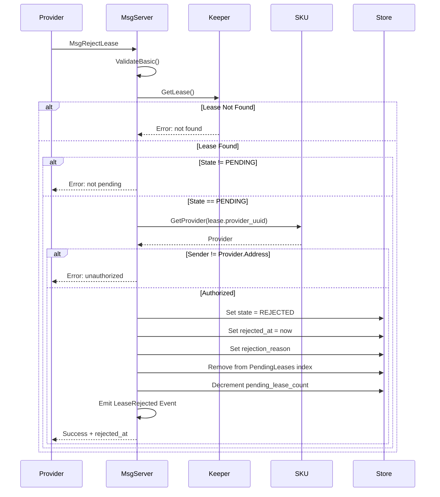

### Settlement (Lazy Evaluation)

Settlement happens during withdrawal or lease closure, not continuously:

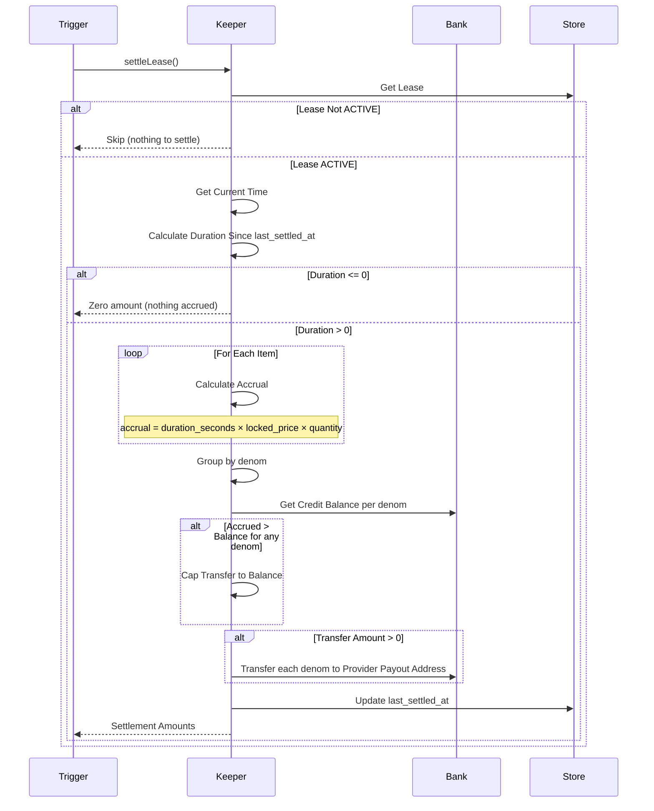

### Close Lease with Settlement

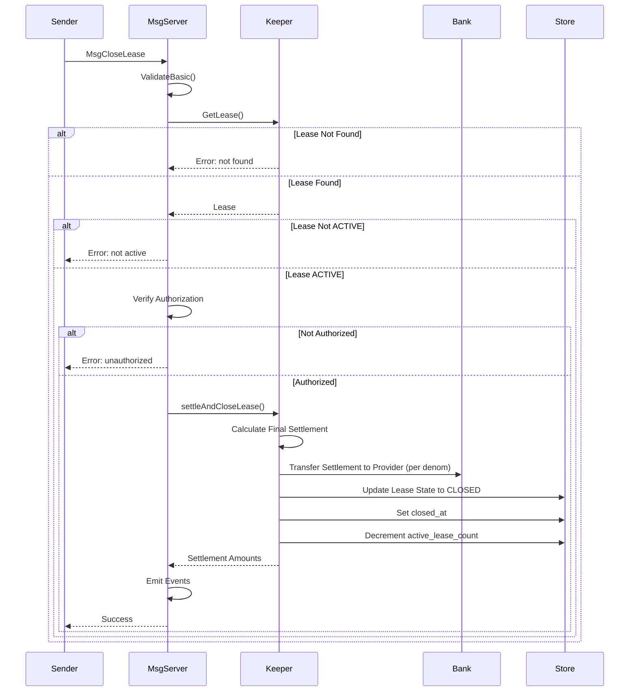

### Withdrawal Flow


## Settlement Triggers

Settlement happens lazily at these points:

| Trigger | Scope | Reason |
|---------|-------|--------|
| `CloseLease` | Target lease only | Final settlement before closure |
| `Withdraw` | Target lease only | Settle accrued amount for provider |
| `WithdrawAll` | All provider's active leases | Batch settlement |

**Note**: Lease queries (`Lease`, `Leases`, `LeasesByTenant`, `LeasesByProvider`) return stored state and do NOT trigger settlement. Use `WithdrawableAmount` or `ProviderWithdrawable` queries to get real-time calculated accrued amounts. Settlement (actual token transfer) only happens during write operations.

### Auto-Close on Credit Exhaustion

When a lease's credit is exhausted (balance = 0), it can be auto-closed via `CheckAndCloseExhaustedLease`:

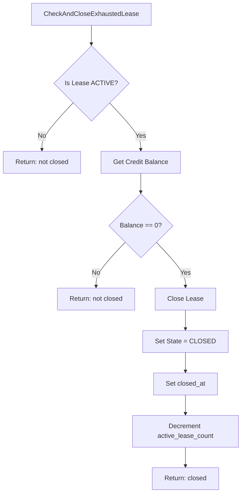

## EndBlocker

The billing module implements an EndBlocker to handle automatic expiration of pending leases:

### Pending Lease Expiration

Leases that remain in `PENDING` state beyond the `pending_timeout` (default 30 minutes) are automatically expired:

```go
func (k Keeper) EndBlocker(ctx context.Context) error {
    sdkCtx := sdk.UnwrapSDKContext(ctx)
    now := sdkCtx.BlockTime()
    params := k.GetParams(ctx)
    pendingTimeout := time.Duration(params.PendingTimeout) * time.Second

    // Iterate pending leases by creation time (oldest first)
    expired := 0
    maxPerBlock := 100

    for _, lease := range k.IteratePendingLeasesByTime(ctx) {
        if expired >= maxPerBlock {
            break // Rate limit: max 100 per block
        }
        
        expirationTime := lease.CreatedAt.Add(pendingTimeout)
        if now.After(expirationTime) {
            k.ExpirePendingLease(ctx, &lease)
            expired++
        } else {
            break // Leases are time-ordered, no more expired
        }
    }
    
    return nil
}
```

#### Rate Limiting

To prevent DoS attacks where an attacker creates many pending leases to overload the EndBlocker:

1. **Max 100 expirations per block** - Ensures bounded computation
2. **Max pending leases per tenant** (default 10) - Limits spam from individual accounts
3. **Remaining leases expire in subsequent blocks** - No lease is left indefinitely
4. **Time-ordered index** - O(1) access to oldest pending leases

#### Lease State on Expiration

When a lease expires:
- State changes from `PENDING` → `EXPIRED`
- `expired_at` timestamp is set
- `pending_lease_count` is decremented
- Credit remains in tenant's account (was never billed since lease never activated)
- `LeaseExpired` event is emitted

## Credit Account Multi-Denom Support

Credit accounts support multiple token denominations. Since credit accounts are regular bank module accounts, they can hold any token type. This enables:

- Different SKUs can use different payment tokens
- Tenants fund their credit with the tokens required by their target SKUs
- Settlement transfers happen per-denom to the provider's payout address

**No send restrictions** are applied to credit accounts - any token can be sent to them.

## UUIDv7 Generation

The module uses deterministic UUIDv7 generation for all identifiers (providers, SKUs, leases):

### Why UUIDv7?

- **Time-ordered**: Embeds millisecond timestamp, enabling natural sorting
- **Deterministic**: All validators generate identical UUIDs for the same block
- **Debugging**: Easier to trace and correlate with external systems
- **Future-proof**: No practical limit vs uint64

### Generation Strategy

```go
// UUIDv7 format: timestamp (48 bits) + version (4 bits) + sequence (12 bits) + variant (2 bits) + node (62 bits)
func GenerateUUIDv7(ctx context.Context, sequence uint64) string {
    blockTime := sdk.UnwrapSDKContext(ctx).BlockTime()
    timestamp := blockTime.UnixMilli()
    
    // Deterministic node ID from chain-id + module name
    nodeID := hash(chainID + moduleName)[:8]
    
    // Combine: timestamp + version(7) + sequence + variant + nodeID
    return formatUUIDv7(timestamp, sequence, nodeID)
}
```

See `pkg/uuid/uuid.go` for the full implementation.

## Accrual Calculation

**Important**: Billing only accrues for ACTIVE leases. PENDING leases do not accrue charges. Billing starts from `acknowledged_at` timestamp.

### Per-Second Rate (at Lease Creation)

The `locked_price` stored in `LeaseItem` is already the per-second rate, calculated at lease creation:

```go
// During lease creation
lockedPricePerSecond = skutypes.CalculatePricePerSecond(sku.BasePrice, sku.Unit)
```

### Accrual Formula

```
elapsed_seconds = current_time - last_settled_at
item_accrual = elapsed_seconds × locked_price.Amount × quantity
total_accrual = sum(item_accrual for all items, grouped by denom)
```

### Multi-Denom Settlement

When a lease contains SKUs with different denominations:
1. Accruals are calculated per-item
2. Amounts are grouped by denomination
3. Each denom is transferred separately to the provider's payout address

### Example

SKU 1: 3600upwr per hour → 1upwr per second (locked_price = {denom: "upwr", amount: 1})
SKU 2: 7200umfx per hour → 2umfx per second (locked_price = {denom: "umfx", amount: 2})
Quantities: SKU 1 = 5 instances, SKU 2 = 3 instances
Elapsed: 100 seconds

```
item1_accrual = 100 × 1 × 5 = 500upwr
item2_accrual = 100 × 2 × 3 = 600umfx
total_accrual = [500upwr, 600umfx]
```

## Parameters

| Parameter | Type | Default | Description |
|-----------|------|---------|-------------|
| `max_leases_per_tenant` | `uint64` | 100 | Max active leases per tenant |
| `max_items_per_lease` | `uint64` | 20 | Max items in single lease |
| `min_lease_duration` | `uint64` | 3600 | Minimum seconds of credit required to create a lease |
| `max_pending_leases_per_tenant` | `uint64` | 10 | Max PENDING leases per tenant |
| `pending_timeout` | `uint64` | 1800 | Seconds before PENDING lease expires (30 min) |
| `allowed_list` | `[]string` | `[]` | Addresses that can create leases for tenants (in addition to authority) |

**Note**: There is no global `denom` parameter. Each SKU defines its own denomination in its `base_price`. This enables multi-denom billing where different SKUs can be priced in different tokens.

**Note**: `WithdrawAll` limits are enforced via constants, not parameters:
- Default limit: 50 leases per call
- Maximum limit: 100 leases per call

## Events

| Event | Key Attributes | When Emitted |
|-------|----------------|--------------|
| `credit_funded` | `tenant`, `amount`, `credit_address` | Credit account funded |
| `lease_created` | `lease_uuid`, `tenant`, `provider_uuid`, `items` | New lease created (PENDING) |
| `lease_acknowledged` | `lease_uuid`, `provider_uuid`, `acknowledged_at` | Provider acknowledged lease (→ ACTIVE) |
| `lease_rejected` | `lease_uuid`, `provider_uuid`, `reason`, `rejected_at` | Provider rejected lease |
| `lease_cancelled` | `lease_uuid`, `tenant` | Tenant cancelled pending lease |
| `lease_expired` | `lease_uuid`, `tenant`, `expired_at` | Pending lease expired |
| `lease_closed` | `lease_uuid`, `tenant`, `settled_amounts` | Lease closed (manual or auto) |
| `provider_withdrawal` | `lease_uuid`, `provider_uuid`, `amounts`, `payout_address` | Provider withdrew funds |

## Error Codes

| Error | Description |
|-------|-------------|
| `ErrCreditAccountNotFound` | Tenant has no credit account |
| `ErrInsufficientCredit` | Credit balance below minimum required |
| `ErrLeaseNotFound` | Lease does not exist |
| `ErrLeaseNotActive` | Lease is not in ACTIVE state |
| `ErrLeaseNotPending` | Lease is not in PENDING state |
| `ErrUnauthorized` | Sender not authorized for operation |
| `ErrInvalidLease` | Lease validation failed |
| `ErrMaxLeasesReached` | Tenant at max active leases |
| `ErrMaxPendingLeasesReached` | Tenant at max pending leases |
| `ErrNoWithdrawable` | Nothing to withdraw |
| `ErrInvalidCreditOperation` | Credit operation failed |
| `ErrProviderNotFound` | Referenced provider not found |
| `ErrSKUNotFound` | Referenced SKU not found |
| `ErrSKUInactive` | SKU is deactivated |
| `ErrInvalidDenomination` | Wrong token denomination |
| `ErrEmptyLeaseItems` | Lease has no items |
| `ErrTooManyLeaseItems` | Lease exceeds max items |
| `ErrDuplicateSKU` | Same SKU appears multiple times in lease |
| `ErrInvalidQuantity` | Item quantity is zero |
| `ErrInvalidParams` | Invalid module parameters |

## Security Considerations

### Authorization Matrix

| Operation | Tenant | Provider | Authority | Allow-Listed |
|-----------|--------|----------|-----------|--------------|
| FundCredit | ✓ (any) | ✓ (any) | ✓ | ✓ |
| CreateLease | ✓ (self) | ✗ | ✗ | ✗ |
| CreateLeaseForTenant | ✗ | ✗ | ✓ | ✓ |
| AcknowledgeLease | ✗ | ✓ (own SKU) | ✓ | ✗ |
| RejectLease | ✗ | ✓ (own SKU) | ✓ | ✗ |
| CancelLease | ✓ (own pending) | ✗ | ✗ | ✗ |
| CloseLease | ✓ (own active) | ✓ (own SKU) | ✓ | ✗ |
| Withdraw | ✗ | ✓ (own) | ✓ | ✗ |
| WithdrawAll | ✗ | ✓ (own) | ✓ | ✗ |
| UpdateParams | ✗ | ✗ | ✓ | ✗ |

### Overflow Protection

Accrual calculations use safe math operations to prevent overflow:

```go
func CalculateTotalAccruedForLease(items []LeaseItemWithPrice, duration time.Duration) (math.Int, error) {
    totalAccrued := math.ZeroInt()
    durationSeconds := int64(duration.Seconds())
    
    for _, item := range items {
        itemAccrued, err := CalculateAccruedAmount(durationSeconds, item.LockedPricePerSecond, item.Quantity)
        if err != nil {
            return math.Int{}, err
        }
        totalAccrued = totalAccrued.Add(itemAccrued)
    }
    return totalAccrued, nil
}
```

### DoS Mitigations

1. **Max leases per tenant** - Prevents active lease spam
2. **Max pending leases per tenant** - Prevents pending lease spam
3. **Max items per lease** - Limits computation per lease
4. **Withdrawal batch size** - Caps WithdrawAll iterations (max 100)
5. **Min lease duration** - Prevents immediate exhaustion
6. **Lazy settlement** - No per-block overhead for accrual calculation
7. **EndBlocker rate limiting** - Max 100 pending lease expirations per block
8. **Indexed lookups** - O(1) credit account detection
9. **Same provider requirement** - Simplifies acknowledgement flow

## Performance Characteristics

| Operation | Complexity | Notes |
|-----------|------------|-------|
| FundCredit | O(1) | Bank transfer + storage write |
| CreateLease | O(m) | m = items in lease |
| AcknowledgeLease | O(1) | State change + index updates |
| RejectLease | O(1) | State change + index updates |
| CancelLease | O(1) | State change + index updates |
| CloseLease | O(m) | m = items in lease |
| Withdraw | O(m) | m = items in lease |
| WithdrawAll | O(k×m) | k = leases (max 100), m = avg items |
| GetCreditBalance | O(1) | Bank query |
| isCreditAccount | O(1) | Reverse lookup map |
| GetLeasesByTenant | O(n) | n = tenant's leases |
| GetLeasesByProvider | O(n) | n = provider's leases |
| EndBlocker | O(e) | e = expired leases (max 100/block) |

## Testing Strategy

### Unit Tests (`x/billing/keeper/*_test.go`)
- Message validation (`ValidateBasic`)
- Accrual calculations
- Settlement logic (partial/full credit exhaustion)
- Lease lifecycle (PENDING → ACTIVE → CLOSED)
- Provider acknowledgement/rejection
- Tenant cancellation
- Pending expiration
- Authorization checks (tenant, provider, authority)
- Error scenarios (non-existent lease, unauthorized, wrong state)
- Genesis import/export

### Integration Tests (`x/billing/keeper/*_test.go`)
- Full message flows with real app context
- Multi-lease scenarios
- Credit account lifecycle
- EndBlocker pending expiration

### E2E Tests (`interchaintest/billing_test.go`)
- Complete billing cycle with PENDING → ACTIVE flow
- Provider acknowledgement and rejection
- Tenant lease cancellation
- Provider withdrawals
- Multi-denom scenarios
- Credit exhaustion and auto-close

### Group/POA Tests (`interchaintest/poa_group_test.go`)
- Provider/SKU management via group proposals
- Lease creation for tenants via authority
- Lease acknowledgement via group proposals
- Withdrawal via group proposals

### Simulation (`x/billing/simulation/`)
- Random operations including acknowledge/reject
- Stress testing
- State consistency
