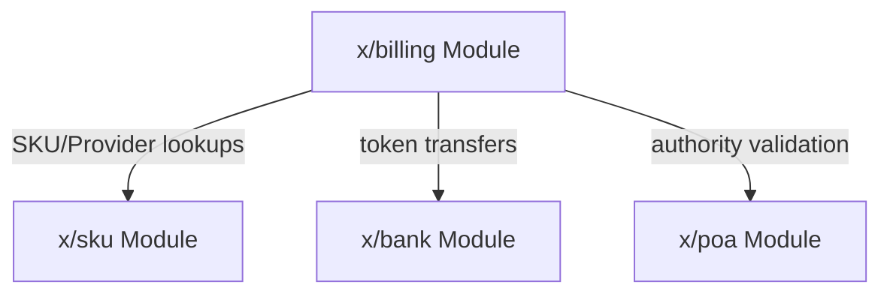
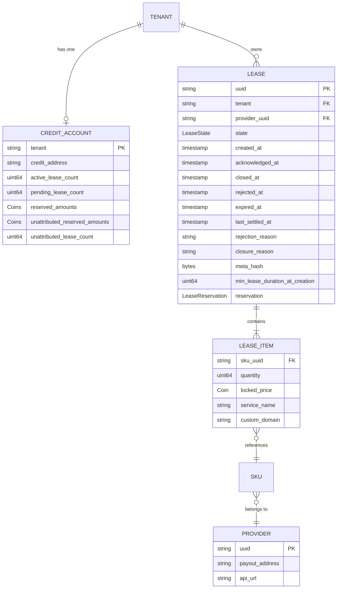
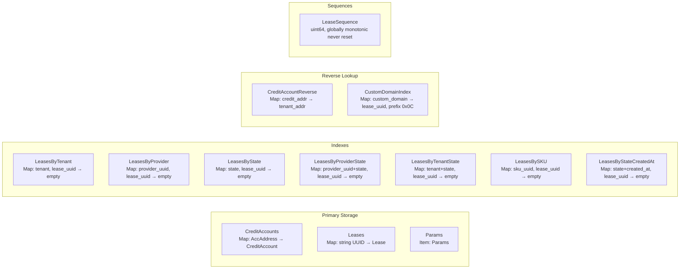
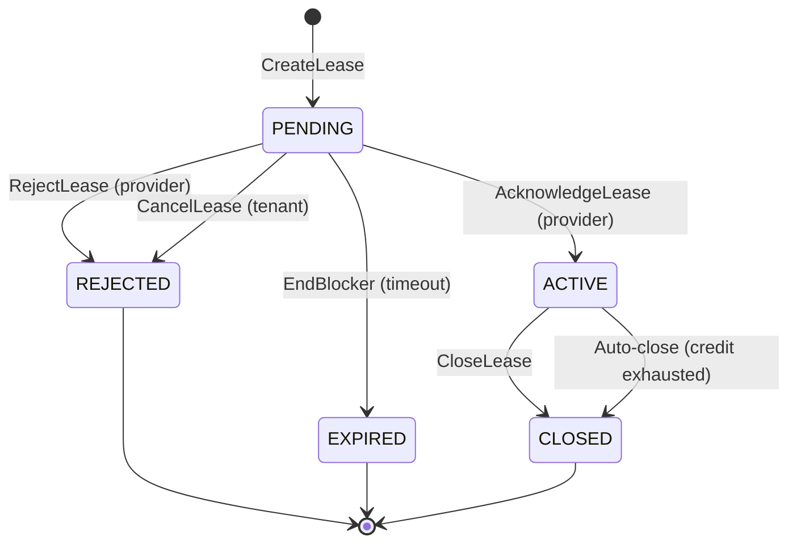
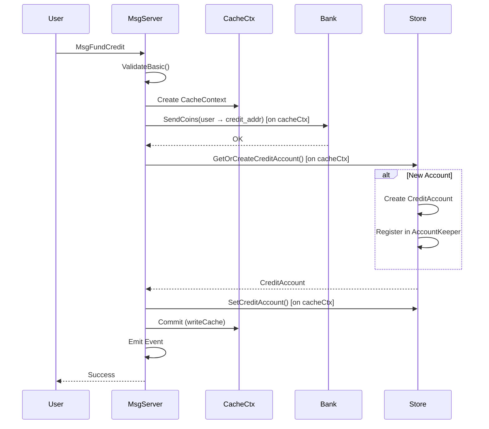
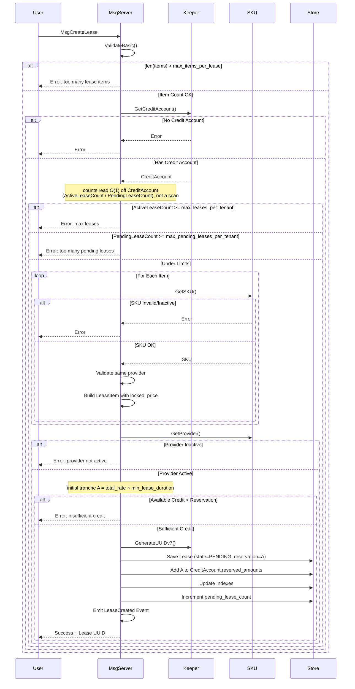
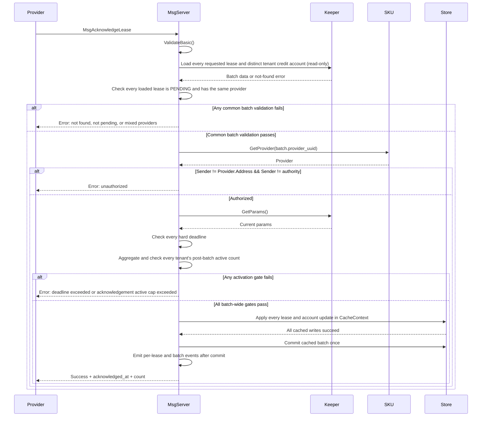
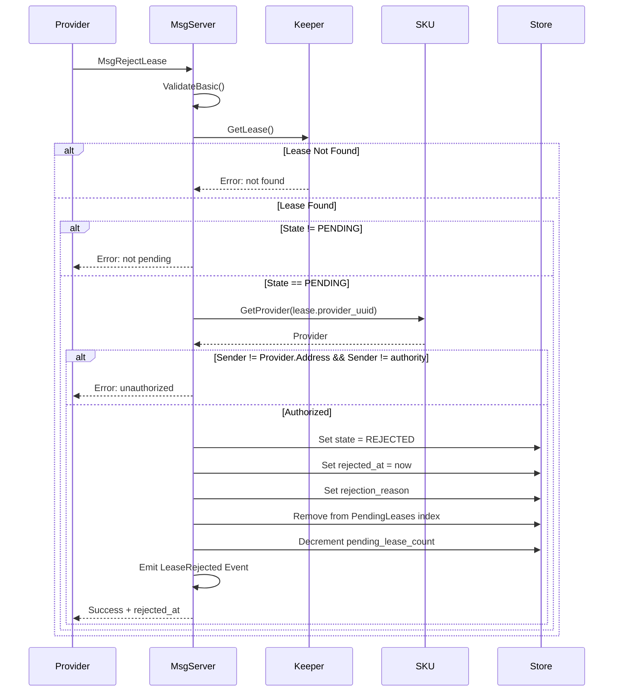
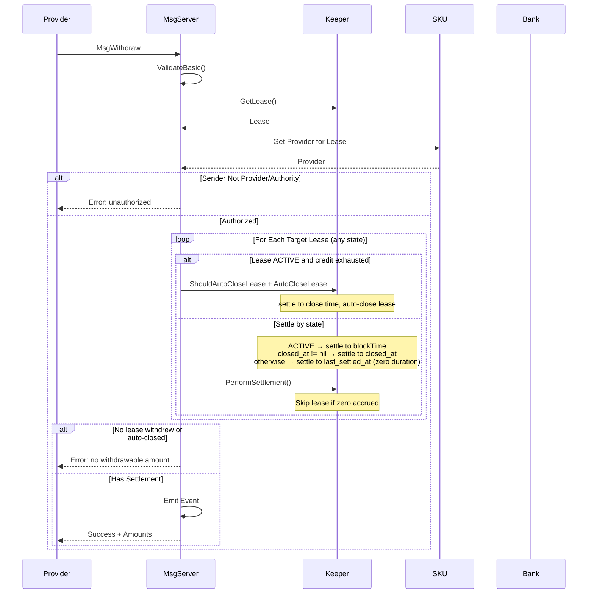
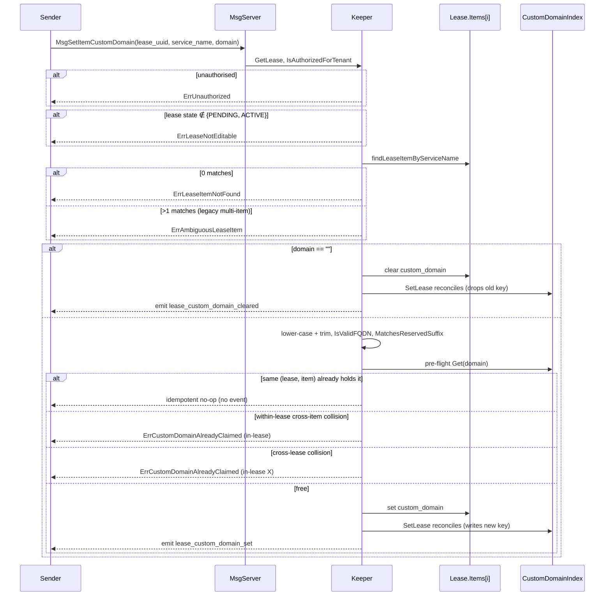

# Billing Module Architecture

This document describes the internal architecture of the x/billing module for developers who need to understand, maintain, or extend the module.

## Overview

The Billing module implements a cloud-like billing system where tenants lease resources (SKUs) and are charged from a pre-funded credit account. Key features:

- **PENDING → ACTIVE lifecycle**: Leases start in PENDING state and require provider acknowledgement before billing begins
- **UUIDv7 identifiers**: Providers, SKUs, and Leases use deterministic UUIDv7 for unique identification
- **Multi-denom support**: Different SKUs can use different payment tokens
- **Lazy settlement**: Charges are calculated on-demand during withdrawals/closures
- **Automatic expiration**: EndBlocker expires pending leases that exceed timeout

## Module Dependencies


```mermaid
graph TD
    Billing[x/billing Module]
    SKU[x/sku Module]
    Bank[x/bank Module]
    POA[x/poa Module]
    
    Billing -->|SKU/Provider lookups| SKU
    Billing -->|token transfers| Bank
    Billing -->|authority validation| POA
```

The Billing module:
- **Depends on**: 
  - `x/sku` for SKU and Provider information (UUIDs, prices, payout addresses)
  - `x/bank` for token transfers
  - `x/poa` for authority validation

## Data Model

### Entity Relationship Diagram


```mermaid
erDiagram
    TENANT ||--o| CREDIT_ACCOUNT : "has one"
    TENANT ||--o{ LEASE : "owns"
    LEASE ||--|{ LEASE_ITEM : "contains"
    LEASE_ITEM }o--|| SKU : "references"
    SKU }o--|| PROVIDER : "belongs to"
    
    CREDIT_ACCOUNT {
        string tenant PK
        string credit_address
        uint64 active_lease_count
        uint64 pending_lease_count
        Coins reserved_amounts
        Coins unattributed_reserved_amounts
        uint64 unattributed_lease_count
    }
    
    LEASE {
        string uuid PK
        string tenant FK
        string provider_uuid FK
        LeaseState state
        timestamp created_at
        timestamp acknowledged_at
        timestamp closed_at
        timestamp rejected_at
        timestamp expired_at
        timestamp last_settled_at
        string rejection_reason
        string closure_reason
        bytes meta_hash
        uint64 min_lease_duration_at_creation
        LeaseReservation reservation
    }
    
    LEASE_ITEM {
        string sku_uuid FK
        uint64 quantity
        Coin locked_price
        string service_name
        string custom_domain
    }
    
    PROVIDER {
        string uuid PK
        string payout_address
        string api_url
    }
```

### CreditAccount

Credit accounts hold pre-funded tokens for lease payments:

| Field | Public/API Type | Description |
|-------|-----------------|-------------|
| `tenant` | Bech32 `string` | Tenant's original address; raw SDK address bytes on disk |
| `credit_address` | Bech32 `string` | Derived credit account address; raw SDK address bytes on disk |
| `active_lease_count` | `uint64` | Number of ACTIVE leases |
| `pending_lease_count` | `uint64` | Number of PENDING leases |
| `reserved_amounts` | `[]Coin` | Exact aggregate `R`: live modern remaining tranches plus the unattributed historical cohort. |
| `unattributed_reserved_amounts` | `[]Coin` | `U`, the subset of `R` shared by live historical leases whose individual guarantees cannot be reconstructed. |
| `unattributed_lease_count` | `uint64` | Exact number of live historical leases sharing `U`; maintained even when `U` is empty. |

The version 4 reservation invariant is evaluated per tenant and denomination:

```
R = SUM(A for each live modern lease) + U
```

`A` is `Lease.reservation.remaining_amounts`. It is consumable state, so an
ACTIVE lease's `A` can be lower than its nominal creation reservation. Modern
PENDING leases retain the full nominal amount; terminal and historical leases
have initialized empty lease-side tranches. `unattributed_lease_count` equals
the number of live historical leases exactly. `U` may be non-zero only while
that count is non-zero, although the count can remain non-zero after the cohort
allocation has been fully consumed.

**Address Derivation:**
```go
// Uses the Cosmos SDK's address.Module function for proper module account derivation
key := append([]byte("billing/credit/"), tenantAddr.Bytes()...)
hash := sha256.Sum256(key)
creditAddr = address.Module("billing", hash[:])
```

See `x/billing/types/credit.go` for the implementation.

### Lease

Leases represent resource rentals with full lifecycle tracking:

| Field | Public/API Type | Description |
|-------|-----------------|-------------|
| `uuid` | `string` | UUIDv7 unique identifier |
| `tenant` | Bech32 `string` | Tenant address; raw SDK address bytes on disk |
| `provider_uuid` | `string` | Provider UUID (denormalized for efficient querying) |
| `items` | `[]LeaseItem` | List of SKU items in this lease |
| `state` | `LeaseState` | PENDING, ACTIVE, CLOSED, REJECTED, or EXPIRED |
| `created_at` | `Timestamp` | When lease was created (credit locked) |
| `acknowledged_at` | `*Timestamp` | When provider acknowledged (billing starts) |
| `closed_at` | `*Timestamp` | When lease was closed |
| `rejected_at` | `*Timestamp` | When provider rejected |
| `expired_at` | `*Timestamp` | When lease expired in PENDING state |
| `last_settled_at` | `Timestamp` | Accrual cursor through which complete seconds have settled; ACTIVE leases retain a sub-second remainder, while CLOSED leases set it to `closed_at` |
| `rejection_reason` | `string` | Provider's rejection explanation (max 256 chars) |
| `closure_reason` | `string` | Explanation for why the lease was closed (max 256 chars) |
| `meta_hash` | `bytes` | Optional hash/reference to off-chain deployment data (max 64 bytes, immutable) |
| `min_lease_duration_at_creation` | `uint64` | The `min_lease_duration` parameter value at lease creation time, for consistent reservation calculation |
| `reservation` | `*LeaseReservation` | Remaining consumable tranche. Presence is required in persisted v4 state; absence marks a complete pre-v4 aggregate-only (v2/v3) genesis export before normalization. |

### LeaseItem

Individual line items within a lease:

| Field | Type | Description |
|-------|------|-------------|
| `sku_uuid` | `string` | Reference to SKU (UUIDv7) |
| `quantity` | `uint64` | Number of units (e.g., 5 instances) |
| `locked_price` | `Coin` | Per-second price locked at lease creation (includes denom) |
| `service_name` | `string` | Optional RFC 1123 DNS label for stack deployments (1-63 lowercase alphanumeric/hyphens) |
| `custom_domain` | `string` | Optional FQDN (≤253 bytes) routed to this item by the provider — see [Custom Domains](#custom-domains-per-item) (v2.1.0+) |

**Note**: The `locked_price` is pre-computed at lease creation as the per-second rate for billing calculations. This is derived from the SKU's base price and unit at the time of lease creation. The denomination is preserved from the SKU's `base_price`, enabling multi-denom billing.

**Service Names**: When `service_name` is set, all items in the lease must have one (all-or-nothing). Uniqueness shifts from `sku_uuid` to `service_name`, allowing the same SKU to appear multiple times for different named services (e.g., "web" and "db" both using a docker-small SKU). This enables stack deployments where the off-chain orchestrator maps each service to its container.

**Custom Domains**: `custom_domain` is mutable post-creation via `MsgSetItemCustomDomain` (`service_name` and the rest of the lease are immutable). Globally unique while the lease is PENDING/ACTIVE — enforced through the `CustomDomainIndex` reverse-index that maps `domain → CustomDomainTarget{lease_uuid, service_name}`. See [Custom Domains](#custom-domains-per-item) for the full flow.

> **Compute-specific fields:** `service_name` and `custom_domain` are pragmatic shortcuts that live on `LeaseItem` today. They will migrate to a future `x/deployment` module once a non-compute lease kind ships (tracked: ENG-80).

### LeaseState Enum

```
LEASE_STATE_UNSPECIFIED = 0  // Invalid
LEASE_STATE_PENDING     = 1  // Awaiting provider acknowledgement (credit locked, not billing)
LEASE_STATE_ACTIVE      = 2  // Provider acknowledged, billing active
LEASE_STATE_CLOSED      = 3  // Terminated normally
LEASE_STATE_REJECTED    = 4  // Provider rejected OR tenant cancelled (credit unlocked)
LEASE_STATE_EXPIRED     = 5  // Pending timeout exceeded (credit unlocked)
```

**Note on REJECTED State**: The `REJECTED` state is used for both provider rejections and tenant cancellations. When a tenant cancels their pending lease via `MsgCancelLease`, the lease transitions to `REJECTED` state with `rejection_reason` set to `"cancelled by tenant"`. This design choice simplifies state management by treating all pre-acknowledgement terminations uniformly. The `lease_cancelled` event is emitted to distinguish tenant cancellations from provider rejections (which emit `lease_rejected`).

## Storage Layout

### Collections


```mermaid
graph LR
    subgraph "Primary Storage"
        CreditAccounts[CreditAccounts<br/>Map: AccAddress → CreditAccount]
        Leases[Leases<br/>Map: string UUID → Lease]
        Params[Params<br/>Item: Params]
    end

    subgraph "Indexes"
        TenantIdx[LeasesByTenant<br/>Map: tenant, lease_uuid → empty]
        ProviderIdx[LeasesByProvider<br/>Map: provider_uuid, lease_uuid → empty]
        StateIdx[LeasesByState<br/>Map: state, lease_uuid → empty]
        ProviderStateIdx[LeasesByProviderState<br/>Map: provider_uuid+state, lease_uuid → empty]
        TenantStateIdx[LeasesByTenantState<br/>Map: tenant+state, lease_uuid → empty]
        SKUIdx[LeasesBySKU<br/>Map: sku_uuid, lease_uuid → empty]
        StateCreatedAtIdx[LeasesByStateCreatedAt<br/>Map: state+created_at, lease_uuid → empty]
    end

    subgraph "Reverse Lookup"
        CreditReverse[CreditAccountReverse<br/>Map: credit_addr → tenant_addr]
        CustomDomainIdx[CustomDomainIndex<br/>Map: custom_domain → lease_uuid, prefix 0x0C]
    end

    subgraph "Sequences"
        LeaseSeq[LeaseSequence<br/>uint64, globally monotonic never reset]
    end
```

| Collection | Key Type | Value Type | Purpose |
|------------|----------|------------|---------|
| `CreditAccounts` | `sdk.AccAddress` | `CreditAccount` | Credit account storage |
| `CreditAccountReverse` | `sdk.AccAddress` | `sdk.AccAddress` | O(1) credit account detection |
| `Leases` | `string` (UUID) | `Lease` | Primary lease storage |
| `LeasesByTenant` | `(AccAddress, string)` | `bool` | Tenant → leases index |
| `LeasesByProvider` | `(string, string)` | `bool` | Provider UUID → leases index |
| `LeasesByState` | `(int32, string)` | `bool` | State → leases index (state-filtered lease queries) |
| `LeasesByProviderState` | `(string, int32, string)` | `bool` | Compound provider+state → leases index |
| `LeasesByTenantState` | `(AccAddress, int32, string)` | `bool` | Compound tenant+state → leases index |
| `LeasesBySKU` | `(string, string)` | `bool` | Many-to-many SKU → leases index. `SetLease` deterministically reconciles the exact old/new SKU sets, including stale-key removal. |
| `LeasesByStateCreatedAt` | `(int32, time.Time, string)` | `bool` | Compound state+created_at → leases index (time-ordered; range-queried by EndBlocker to scan only expirable pending leases) |
| `CustomDomainIndex` | `string` (lower-cased domain) | `CustomDomainTarget` | Reverse lookup `custom_domain → (lease_uuid, service_name)` for O(1) `QueryLeaseByCustomDomain`. Reconciled by `SetLease` whenever lease items change; freed on close/reject/expire/auto-close. |
| `LeaseSequence` | - | `uint64` | Monotonic counter feeding deterministic lease UUIDv7 generation |
| `Params` | - | `Params` | Module parameters |

The manually managed `CreditAccountReverse`, `LeasesBySKU`, and
`CustomDomainIndex` maps are covered by a registered bidirectional invariant.
It walks ordered collection keys and verifies both primary→index and
index→primary membership, so missing and stale entries are detected without
depending on Go map iteration order. `SetLease` stages its primary record and
both lease-derived index reconciliations in one `CacheContext`.

### Storage Versions and Reservation Cutover

Public protobufs keep Bech32 account strings for wire and genesis
compatibility. Consensus version 3's disk-only codecs persist address
identities as raw SDK bytes. The v2→v3 migration rewrites values in ordered,
bounded pages, canonicalizes the allowed list, rebuilds cached live-lease
counts from the byte-keyed PENDING then ACTIVE indexes, and repairs the
provable aggregate reservation floor without changing bank balances.

Consensus version 4 adds consumable per-lease reservation tranches. The v3→v4
cutover is deterministic and never mints, burns, or transfers tokens. For each
tenant, the repaired aggregate must first cover the complete modern PENDING
nominal sum; a short aggregate is corruption and halts. If every denomination
is bank-backed, the complete PENDING cohort keeps its exact claims. If any
denomination is short, all modern PENDING leases for that tenant expire at the
cutover block with empty tranches. This avoids partial guarantees and arbitrary
multi-denomination winners. Hamilton's largest-remainder method then allocates
the remaining bank-backed historical budget to modern ACTIVE nominal claims
and a single opaque live-historical cohort. Active claim ties are broken by
lease UUID; the historical cohort follows them. Terminal leases receive
initialized empty wrappers. The cutover repairs cached counts and
state-dependent indexes, records the exact live historical cohort size in
`unattributed_lease_count`, even if its allocation is empty, and produces the
exact aggregate `R = sum(A) + U`.

Direct import preparation first applies the same decoded-identity count and
aggregate reconciliation as v2→v3, then the same cutover planner normalizes a
complete pre-v4 aggregate-only (v2/v3) genesis export before `InitGenesis`
writes billing state. A mixed pre-v4/v4 representation is rejected. The
cutover fails if the repaired aggregate cannot cover reconstructible PENDING
claims. A bank-only shortfall instead predicts tenant-wide PENDING expiration.
Operators must preflight and communicate that set before an upgrade or import;
the migration does not manufacture backing.

## Core Flows

### Lease Lifecycle


```mermaid
stateDiagram-v2
    [*] --> PENDING: CreateLease
    PENDING --> ACTIVE: AcknowledgeLease (provider)
    PENDING --> REJECTED: RejectLease (provider)
    PENDING --> REJECTED: CancelLease (tenant)
    PENDING --> EXPIRED: EndBlocker (timeout)
    ACTIVE --> CLOSED: CloseLease
    ACTIVE --> CLOSED: Auto-close (credit exhausted)
    REJECTED --> [*]
    EXPIRED --> [*]
    CLOSED --> [*]
```

### Fund Credit Account

Uses CacheContext for atomicity - either both token transfer and credit account creation succeed, or neither does.


```mermaid
sequenceDiagram
    participant User
    participant MsgServer
    participant CacheCtx
    participant Bank
    participant Store

    User->>MsgServer: MsgFundCredit
    MsgServer->>MsgServer: ValidateBasic()
    MsgServer->>CacheCtx: Create CacheContext

    MsgServer->>Bank: SendCoins(user → credit_addr) [on cacheCtx]
    Bank-->>MsgServer: OK

    MsgServer->>Store: GetOrCreateCreditAccount() [on cacheCtx]
    alt New Account
        Store->>Store: Create CreditAccount
        Store->>Store: Register in AccountKeeper
    end
    Store-->>MsgServer: CreditAccount

    MsgServer->>Store: SetCreditAccount() [on cacheCtx]
    MsgServer->>CacheCtx: Commit (writeCache)
    MsgServer->>MsgServer: Emit Event
    MsgServer-->>User: Success
```

**Atomicity Guarantee**: If `SetCreditAccount` fails after `SendCoins` succeeds, the cache is discarded and no state changes occur - tokens are not transferred and no credit account is created.

### Create Lease (PENDING State)


```mermaid
sequenceDiagram
    participant User
    participant MsgServer
    participant Keeper
    participant SKU
    participant Store
    
    User->>MsgServer: MsgCreateLease
    MsgServer->>MsgServer: ValidateBasic()
    
    alt len(items) > max_items_per_lease
        MsgServer-->>User: Error: too many lease items
    else Item Count OK
        MsgServer->>Keeper: GetCreditAccount()
        
        alt No Credit Account
            Keeper-->>MsgServer: Error
            MsgServer-->>User: Error
        else Has Credit Account
            Keeper-->>MsgServer: CreditAccount
            Note over MsgServer: counts read O(1) off CreditAccount<br/>(ActiveLeaseCount / PendingLeaseCount), not a scan
            
            alt ActiveLeaseCount >= max_leases_per_tenant
                MsgServer-->>User: Error: max leases
            else PendingLeaseCount >= max_pending_leases_per_tenant
                MsgServer-->>User: Error: too many pending leases
            else Under Limits
                loop For Each Item
                    MsgServer->>SKU: GetSKU()
                    alt SKU Invalid/Inactive
                        SKU-->>MsgServer: Error
                        MsgServer-->>User: Error
                    else SKU OK
                        SKU-->>MsgServer: SKU
                        MsgServer->>MsgServer: Validate same provider
                        MsgServer->>MsgServer: Build LeaseItem with locked_price
                    end
                end
                
                MsgServer->>SKU: GetProvider()
                alt Provider Inactive
                    MsgServer-->>User: Error: provider not active
                else Provider Active
                    Note over MsgServer: initial tranche A = total_rate × min_lease_duration
                    alt Available Credit < Reservation
                        MsgServer-->>User: Error: insufficient credit
                    else Sufficient Credit
                        MsgServer->>Keeper: GenerateUUIDv7()
                        MsgServer->>Store: Save Lease (state=PENDING, reservation=A)
                        MsgServer->>Store: Add A to CreditAccount.reserved_amounts
                        MsgServer->>Store: Update Indexes
                        MsgServer->>Store: Increment pending_lease_count
                        MsgServer->>MsgServer: Emit LeaseCreated Event
                        MsgServer-->>User: Success + Lease UUID
                    end
                end
            end
        end
    end
```

### Acknowledge Lease (PENDING → ACTIVE)


```mermaid
sequenceDiagram
    participant Provider
    participant MsgServer
    participant Keeper
    participant SKU
    participant Store
    
    Provider->>MsgServer: MsgAcknowledgeLease
    MsgServer->>MsgServer: ValidateBasic()
    MsgServer->>Keeper: Load every requested lease and distinct tenant credit account (read-only)
    Keeper-->>MsgServer: Batch data or not-found error
    MsgServer->>MsgServer: Check every loaded lease is PENDING and has the same provider

    alt Any common batch validation fails
        MsgServer-->>Provider: Error: not found, not pending, or mixed providers
    else Common batch validation passes
        MsgServer->>SKU: GetProvider(batch.provider_uuid)
        SKU-->>MsgServer: Provider

        alt Sender != Provider.Address && Sender != authority
            MsgServer-->>Provider: Error: unauthorized
        else Authorized
            MsgServer->>Keeper: GetParams()
            Keeper-->>MsgServer: Current params
            MsgServer->>MsgServer: Check every hard deadline
            MsgServer->>MsgServer: Aggregate and check every tenant's post-batch active count

            alt Any activation gate fails
                MsgServer-->>Provider: Error: deadline exceeded or acknowledgement active cap exceeded
            else All batch-wide gates pass
                MsgServer->>Store: Apply every lease and account update in CacheContext
                Store-->>MsgServer: All cached writes succeed
                MsgServer->>Store: Commit cached batch once
                MsgServer->>MsgServer: Emit per-lease and batch events after commit
                MsgServer-->>Provider: Success + acknowledged_at + count
            end
        end
    end
```

### Reject Lease (PENDING → REJECTED)


```mermaid
sequenceDiagram
    participant Provider
    participant MsgServer
    participant Keeper
    participant SKU
    participant Store
    
    Provider->>MsgServer: MsgRejectLease
    MsgServer->>MsgServer: ValidateBasic()
    MsgServer->>Keeper: GetLease()
    
    alt Lease Not Found
        Keeper-->>MsgServer: Error: not found
    else Lease Found
        alt State != PENDING
            MsgServer-->>Provider: Error: not pending
        else State == PENDING
            MsgServer->>SKU: GetProvider(lease.provider_uuid)
            SKU-->>MsgServer: Provider
            
            alt Sender != Provider.Address && Sender != authority
                MsgServer-->>Provider: Error: unauthorized
            else Authorized
                MsgServer->>Store: Set state = REJECTED
                MsgServer->>Store: Set rejected_at = now
                MsgServer->>Store: Set rejection_reason
                MsgServer->>Store: Remove from PendingLeases index
                MsgServer->>Store: Decrement pending_lease_count
                MsgServer->>MsgServer: Emit LeaseRejected Event
                MsgServer-->>Provider: Success + rejected_at
            end
        end
    end
```

### Settlement (Lazy Evaluation)

Settlement happens during withdrawal or lease closure, not continuously:

```mermaid
sequenceDiagram
    participant Trigger
    participant Keeper
    participant Bank
    participant Store
    
    Trigger->>Keeper: PerformSettlement()
    Keeper->>Store: Get Lease
    Keeper->>Keeper: Calculate Duration = settleTime − last_settled_at
    Note over Keeper: State is not consulted (PerformSettlement is state-agnostic)
    
    alt Duration <= 0
        Keeper-->>Trigger: Zero amounts (nothing accrued)
    else Duration > 0
        loop For Each Item
            Keeper->>Keeper: Calculate Accrual
            Note over Keeper: accrual = duration_seconds × locked_price × quantity
        end
        
        Keeper->>Keeper: Group by denom
        Keeper->>Bank: Get Credit Balance per denom
        Keeper->>Store: Load account aggregate R and lease allocation A
        Keeper->>Keeper: spendable = B - (R - A)
        Keeper->>Keeper: transfer = min(accrued, spendable)
        Keeper->>Keeper: consumed = min(transfer, A)
        
        alt Transfer Amount > 0
            Keeper->>Bank: Transfer each denom to Provider Payout Address
            Keeper->>Store: Set R = R - consumed
            Keeper->>Store: Set A = A - consumed
        end
        
        Keeper-->>Trigger: Settlement Amounts
    end
    
    Note over Keeper,Store: PerformSettlement / PerformSettlementSilent return SettledThrough;<br/>a live caller persists that whole-second cursor and carries the fractional remainder;<br/>a terminal close persists its exact close time
```

Whole-second truncation is applied to the combined lifetime interval, not
independently to every touch. For an ACTIVE lease, `SettledThrough` is
`settleTime` minus the uncharged sub-second remainder and becomes the next
`last_settled_at`. Repeated sub-second withdrawals therefore equal one
withdrawal over the combined interval. When the lease closes, every complete
second through `closed_at` is charged and the remaining fraction is discarded;
`last_settled_at` is then set exactly to `closed_at`.

The spend planner is own-tranche-first: the target lease may consume its own
remaining guarantee plus genuinely unreserved credit, but never another live
lease's reservation. For a live historical lease, `A` is the shared explicit
`CreditAccount.unattributed_reserved_amounts` cohort; modern leases use their
own `Lease.reservation.remaining_amounts`. All coin operations use canonical
ordered slices.

On a modern lease's terminal transition, `ReleaseLeaseReservation` subtracts
exactly its remaining `A` from `R` and clears the tranche. It never recomputes
a nominal release from current parameters. A historical transition decrements
the persisted `unattributed_lease_count` in O(1), without scanning leases. When
the count reaches zero, the keeper subtracts exactly the remaining `U` from `R`
and clears `U`; the count is still authoritative when `U` has already been
fully consumed.

### Close Lease with Settlement

```mermaid
sequenceDiagram
    participant Sender
    participant MsgServer
    participant Keeper
    participant Bank
    participant Store
    
    Sender->>MsgServer: MsgCloseLease
    MsgServer->>MsgServer: ValidateBasic()
    MsgServer->>Keeper: GetLease()
    
    alt Lease Not Found
        Keeper-->>MsgServer: Error: not found
    else Lease Found
        Keeper-->>MsgServer: Lease
        
        alt Lease Not ACTIVE
            MsgServer-->>Sender: Error: not active
        else Lease ACTIVE
            MsgServer->>MsgServer: Verify Authorization
            alt Not Authorized
                MsgServer-->>Sender: Error: unauthorized
            else Authorized
                alt ShouldAutoCloseLease (credit exhausted)
                    Keeper->>Keeper: PerformSettlementSilent()
                    Note over Keeper: closure_reason = "credit exhausted", closed_by = "credit_exhaustion"<br/>only on a genuine shortfall (overflow, partial settlement, or zero balance);<br/>a full payment preserves msg.Reason and the caller role
                else Normal close
                    Keeper->>Keeper: settleLease()
                    Note over Keeper: closure_reason = msg.Reason
                end
                Keeper->>Bank: Transfer Settlement to Provider (per denom)
                Keeper->>Store: SetLease (state = CLOSED, set closed_at)
                Keeper->>Store: DecrementActiveLeaseCount
                Keeper->>Store: ReleaseLeaseReservation
                Keeper-->>MsgServer: Settlement Amounts
                MsgServer->>MsgServer: Emit Events
                MsgServer-->>Sender: Success
            end
        end
    end
```

### Withdrawal Flow


```mermaid
sequenceDiagram
    participant Provider
    participant MsgServer
    participant Keeper
    participant SKU
    participant Bank
    
    Provider->>MsgServer: MsgWithdraw
    MsgServer->>MsgServer: ValidateBasic()
    MsgServer->>Keeper: GetLease()
    Keeper-->>MsgServer: Lease
    
    MsgServer->>SKU: Get Provider for Lease
    SKU-->>MsgServer: Provider
    
    alt Sender Not Provider/Authority
        MsgServer-->>Provider: Error: unauthorized
    else Authorized
        loop For Each Target Lease (any state)
            alt Lease ACTIVE and credit exhausted
                MsgServer->>Keeper: ShouldAutoCloseLease + AutoCloseLease
                Note over Keeper: settle to close time, auto-close lease
            else Settle by state
                Note over Keeper: ACTIVE → settle to blockTime<br/>closed_at != nil → settle to closed_at<br/>otherwise → settle to last_settled_at (zero duration)
                MsgServer->>Keeper: PerformSettlement()
                Note over Keeper: Skip lease if zero accrued
            end
        end
        
        alt No lease withdrew or auto-closed
            MsgServer-->>Provider: Error: no withdrawable amount
        else Has Settlement
            MsgServer->>MsgServer: Emit Event
            MsgServer-->>Provider: Success + Amounts
        end
    end
```

## Custom Domains (per-item)

> Available since v2.1.0 (PR #152). Implemented in `x/billing/keeper/custom_domain.go` and `x/billing/types/msgs.go` (`IsValidFQDN`, `MatchesReservedSuffix`).

### Purpose

Each `LeaseItem` can carry an optional `custom_domain` — an FQDN the provider routes to that item's container with a TLS cert provisioned via HTTP-01. Domains are claimed and released entirely on-chain: the provider runs `QueryLeaseByCustomDomain` against incoming HTTP host headers and trusts the returned `(lease_uuid, service_name)` as the routing target.

### State

- `CustomDomainIndex` (collection prefix `0x0C`): `string → CustomDomainTarget{lease_uuid, service_name}`. Keys are the canonical (lower-cased, trimmed) domain. Only PENDING/ACTIVE leases hold entries.
- The same `custom_domain` string is also stored on `LeaseItem.custom_domain` so the lease record carries the claim independently of the index. `SetLease` reconciles both representations on every write.

### Authorisation

`MsgSetItemCustomDomain` is signed by `sender` and accepted when:
1. `sender == lease.tenant`, **or**
2. `sender == module authority`, **or**
3. `sender ∈ params.allowed_list`.

The matching role is recorded in the emitted event's `set_by` attribute (`tenant` / `authority` / `allowed`) so off-chain auditors can attribute changes.

### Validation

A non-empty domain must pass `IsValidFQDN`:
- length 1–253 bytes (`MaxCustomDomainLength`);
- **lowercase only — the transaction is rejected at `MsgSetItemCustomDomain.ValidateBasic()` (which calls `IsValidFQDN` directly) before reaching the keeper. Callers must lower-case `custom_domain` client-side before signing.** The keeper additionally `strings.ToLower(strings.TrimSpace(...))`s the value as defence-in-depth on the storage path, but that normalisation never runs against mixed-case input in practice;
- ≥ 1 dot separator (rejects bare hostnames);
- each label is RFC 1123 (1–63 alphanumerics + hyphens, no leading/trailing hyphen);
- the TLD label has at least one non-digit character (rejects raw IPv4);
- no scheme (`://`), no `/`, ` `, `\t`, `@`, `*`, `?`, `#`;
- no leading or trailing dot.

It must also pass `MatchesReservedSuffix(params.ReservedDomainSuffixes)` ⇒ `false`. Each reserved-suffix entry must begin with `.`; a domain matches when it ends with the suffix at a label boundary, or equals the suffix's apex (`.foo.example` matches both `app.foo.example` and `foo.example`). The check is case-insensitive and **fail-closed** on malformed entries (so a corrupted params slice can't accidentally permit reserved domains).

### Lookup contract

The keeper resolves the target item by `service_name`:

| Lease shape | Caller passes | Match |
|---|---|---|
| 1-item legacy (item.service_name `""`) | `service_name == ""` | the single item |
| Multi-item, service-name mode | `service_name == "web"` | the unique item with that name |
| Multi-item legacy (no service_names) | any value | rejected with `ErrAmbiguousLeaseItem` — recreate in service-name mode |

The lookup is wrapped in a defensive guard: even though `ValidateLeaseItems` and the genesis check prevent multi-item legacy leases from existing, the keeper rejects them at the lookup site rather than relying on construction-time invariants.

### Set / clear flow (`MsgSetItemCustomDomain`)


```mermaid
sequenceDiagram
    participant Sender
    participant MsgServer
    participant Keeper
    participant Lease as Lease.Items[i]
    participant Index as CustomDomainIndex

    Sender->>MsgServer: MsgSetItemCustomDomain(lease_uuid, service_name, domain)
    MsgServer->>Keeper: GetLease, IsAuthorizedForTenant
    alt unauthorised
        Keeper-->>Sender: ErrUnauthorized
    end
    alt lease state ∉ {PENDING, ACTIVE}
        Keeper-->>Sender: ErrLeaseNotEditable
    end
    Keeper->>Lease: findLeaseItemByServiceName
    alt 0 matches
        Keeper-->>Sender: ErrLeaseItemNotFound
    else >1 matches (legacy multi-item)
        Keeper-->>Sender: ErrAmbiguousLeaseItem
    end
    alt domain == ""
        Keeper->>Lease: clear custom_domain
        Keeper->>Index: SetLease reconciles (drops old key)
        Keeper-->>Sender: emit lease_custom_domain_cleared
    else
        Keeper->>Keeper: lower-case + trim, IsValidFQDN, MatchesReservedSuffix
        Keeper->>Index: pre-flight Get(domain)
        alt same (lease, item) already holds it
            Keeper-->>Sender: idempotent no-op (no event)
        else within-lease cross-item collision
            Keeper-->>Sender: ErrCustomDomainAlreadyClaimed (in-lease)
        else cross-lease collision
            Keeper-->>Sender: ErrCustomDomainAlreadyClaimed (in-lease X)
        else free
            Keeper->>Lease: set custom_domain
            Keeper->>Index: SetLease reconciles (writes new key)
            Keeper-->>Sender: emit lease_custom_domain_set
        end
    end
```

The pre-flight uniqueness check is a UX layer: `SetLease`'s storage-level reconciliation is the defence-in-depth that prevents two simultaneous claims from racing through.

### Index lifecycle

`CustomDomainIndex` entries are created and freed exclusively through `SetLease`'s reconciliation pass. As a result:
- closing a lease (`MsgCloseLease`, auto-close on credit exhaustion);
- rejecting a lease (`MsgRejectLease`);
- a tenant cancelling a pending lease (`MsgCancelLease`);
- a pending lease expiring in EndBlocker;

each free every `custom_domain` the lease held in a single SetLease call. Genesis import re-derives the index from `LeaseItem.custom_domain` values for PENDING/ACTIVE leases only.

### Query

`QueryLeaseByCustomDomain` is the only read path that uses the index. It lower-cases and trims the input domain before lookup so case-insensitive HTTP host headers work without per-caller normalisation. The response carries the full `Lease` plus the `service_name` of the matching item — for a 1-item legacy lease the `service_name` is `""`.

## Settlement Triggers

Settlement happens lazily at these points:

| Trigger | Scope | Reason |
|---------|-------|--------|
| `CloseLease` | Target lease(s) only | Final settlement before closure |
| `Withdraw` (specific leases) | Target lease(s) only | Settle the lease-spendable portion of accrued amount for provider |
| `Withdraw` (provider-wide) | Current forward page of ACTIVE leases (default 50, max 100) | Bounded batch settlement |

**Note**: Lease queries (`Lease`, `Leases`, `LeasesByTenant`, `LeasesByProvider`) return stored state and do NOT trigger settlement. `WithdrawableAmount` calculates one lease's current amount. `ProviderWithdrawable` dry-runs exactly the returned ACTIVE-lease page in index order against page-local virtual tenant balances and reservations, so shared credit is counted once within that page. Each lease uses a nested cache: failed simulations are discarded, successful virtual effects feed later leases, and the outer query cache is never committed. This mirrors provider-wide withdrawal's best-effort per-lease behavior. Its pages are not additive snapshots. Every forward query page is comparable to one provider-wide withdrawal because the query limit is capped at the transaction maximum of 100. After commit, advance the query with the prior query response's first-unread cursor and the transaction with the prior transaction response's last-processed cursor; never interchange them. Settlement (actual token transfer) only happens during write operations.

`CreditAccount` delegates to the SDK bank module's canonical balance query and
returns all denoms through cursor pages (default 100, maximum 1000). Offset and
`count_total` are rejected so bank-store work stays proportional to the
requested page; `available_balances` covers the same page. Reverse pages follow
`x/bank` and return both coin lists in descending denomination order, so Go
callers must call `Sort()` before using `sdk.Coins` operations that require
canonical ascending order. It never scans leases. The embedded account
aggregate is not separately paginated. New leases
cannot grow it beyond 1,000 reserved denominations; a historical v2 account
already above that limit remains readable and releasable, so decoding such an
account can still exceed the balance-page cost during the compatibility window.

`CreditEstimate` is intentionally unpaginated and uses the stored ACTIVE count
rather than a mutable governance limit. It enforces the conservative 11,000
lease ceiling (the exact v2 reachable maximum is 10,999), a 100,000-item work
ceiling, and exact stored-count/index agreement. Violations return
`ErrLeaseQueryLimitExceeded` / gRPC `ResourceExhausted` or
`ErrReservationInvariant` / gRPC `Internal`; the query never returns a partial
estimate.

**Transaction Ordering Note**: Within a single block, transaction order matters. If a block contains both a `FundCredit` transaction and a `CloseLease` transaction for the same tenant, the outcome depends on which transaction is processed first. This is standard blockchain behavior—settlement reads the credit balance at the time of execution. Users should ensure funding is confirmed before triggering settlement-dependent operations.

### Atomic Settlement in Provider-Wide Withdraw

The provider-wide withdraw mode uses a **cached context pattern** to ensure atomicity per lease:

```go
// For each lease in the batch:
cacheCtx, writeFn := ctx.CacheContext()
lease, err := k.GetLease(cacheCtx, leaseUUID)
if err != nil { continue }
account, err := k.GetCreditAccount(cacheCtx, lease.Tenant)
if err != nil { continue }

shouldClose, closeTime, err := k.ShouldAutoCloseLease(cacheCtx, &lease, &account)
if err != nil { continue }
if shouldClose {
    // Settles spendable credit, closes the lease, decrements its count, releases
    // its remaining reservation, and writes both records to this per-lease cache.
    result, err := k.AutoCloseLease(cacheCtx, &lease, &account, closeTime)
    if err != nil { continue }
    updatedTotal, err := types.SafeAddCoins(totalAmounts, result.TransferAmounts)
    if err != nil { return err }
    writeFn()
    totalAmounts = updatedTotal
    continue
}

// A normal no-op does not advance the timestamp or write either record.
if !blockTime.After(lease.LastSettledAt) { continue }
result, err := k.PerformSettlementSilent(cacheCtx, &lease, &account, blockTime)
if err != nil || result.TransferAmounts.IsZero() { continue }

lease.LastSettledAt = result.SettledThrough
if err := k.SetLease(cacheCtx, lease); err != nil { continue }
if err := k.SetCreditAccount(cacheCtx, account); err != nil { continue }
updatedTotal, err := types.SafeAddCoins(totalAmounts, result.TransferAmounts)
if err != nil { return err }

// Commit transfer, timestamp, A, and R together only after every write succeeds.
writeFn()
totalAmounts = updatedTotal
```

**Behavior**:
- Each lease's settlement is atomic (all-or-nothing)
- If settlement fails for one lease (e.g., a bank transfer error, a payout
  address that resolves to that tenant's derived credit address, malformed
  stored lease/account data, or a `last_settled_at` after block time), only that
  lease is logged, reported, and skipped. Provider lookup, authorization, and
  payout-address validation are request-wide gates and fail before page work.
- Other leases in the batch are processed normally
- Failed leases don't affect the success of the overall operation
- Failed lease UUIDs are returned in provider index order and emitted on the
  deterministic `batch_withdraw` summary (`failed_lease_count` plus a
  comma-separated `failed_lease_uuids` attribute)
- Provider can correct the cause and retry failed leases individually using
  specific lease UUIDs; their per-lease caches were discarded

> **Accrual overflow is NOT a skip.** If an accrued charge cannot fit in the SDK's 256-bit `math.Int` representation, the silent settlement path (`PerformSettlementSilent`) does *not* grant free service. It clamps each overflowed denomination to this lease's spendable credit `B - (R - A)` and transfers it to the provider; exact charges in unaffected denominations are settled normally. `ShouldAutoCloseLease` then force-closes the lease. The overflow may arise from price × quantity, price × quantity × elapsed seconds, or same-denom aggregation. Long intervals are valid when their charge remains representable, and runtime accrual derives whole seconds directly from timestamps so `time.Duration` saturation cannot undercharge intervals beyond roughly 292 years. Non-silent settlement, lease creation, credit-estimate queries, genesis validation, and migrations instead return the registered `ErrArithmeticOverflow` error; withdrawable queries return the exact spendable-capped amount.

This pattern ensures that partial failures don't corrupt state while still providing best-effort batch processing.

Settlement compares SDK-decoded address bytes and rejects a provider payout
address equal to the source tenant credit address. A self-send would leave the
bank balance unchanged while falsely appearing to settle accrued credit;
different Bech32 casing therefore cannot bypass this check. Specific-lease
withdraw and `CloseLease` wrap the whole requested batch in one cached context,
so this error rolls back every earlier transfer and state update in that batch.

### Auto-Close on Credit Exhaustion

When a lease's credit is exhausted, it can be auto-closed via `ShouldAutoCloseLease` + `AutoCloseLease`:

```mermaid
flowchart TD
    A[ShouldAutoCloseLease] --> B{Is Lease ACTIVE?}
    B -->|No| C[Return: not closed]
    B -->|Yes| D[Load B, R, and lease allocation A]
    D --> E[Calculate Accrued and spendable B - (R - A)]
    E --> F{Accrued >= Spendable?}
    F -->|No| G[Return: not closed]
    F -->|Yes| H[AutoCloseLease]
    H --> I[Settle + Set State = CLOSED]
    I --> J[Set closed_at]
    J --> K[Decrement active_lease_count]
    K --> L[Release reservation]
    L --> M[Return: closed]
```

## EndBlocker

The billing module implements an EndBlocker to handle automatic expiration of pending leases:

### Pending Lease Expiration

Leases that remain in `PENDING` state beyond the `pending_timeout` (default 30 minutes) are automatically expired:

The same strict predicate is enforced synchronously by `AcknowledgeLease`: acknowledgement is
valid exactly at `created_at + current pending_timeout` and rejected when block time is strictly
later. EndBlock cleanup is rate-limited, so an overdue lease can remain stored as PENDING for later
blocks, but it is already unacknowledgeable; provider rejection and tenant cancellation remain valid.

```go
func (k Keeper) EndBlocker(ctx context.Context) error {
    sdkCtx := sdk.UnwrapSDKContext(ctx)
    now := sdkCtx.BlockTime()
    params, err := k.GetParams(ctx)
    if err != nil {
        return err
    }
    pendingTimeout := time.Duration(params.PendingTimeout) * time.Second

    // Two-pass approach to avoid iterator invalidation.
    // Pass 1: collect UUIDs of expired pending leases by range-querying the
    // StateCreatedAt index (keyed ((state, created_at), uuid)) for
    // created_at < now - pendingTimeout, so only expirable leases are visited
    // (O(expired) instead of O(total pending)). The upper bound is exclusive at
    // the cutoff because expiry is strict (created_at < cutoff).
    cutoff := now.Add(-pendingTimeout)
    pendingState := int32(types.LEASE_STATE_PENDING)
    scanRange := new(collections.Range[collections.Pair[collections.Pair[int32, time.Time], string]]).
        StartInclusive(collections.Join(collections.Join(pendingState, time.Time{}), "")).
        EndExclusive(collections.Join(collections.Join(pendingState, cutoff), ""))
    iter, err := k.Leases.Indexes.StateCreatedAt.Iterate(ctx, scanRange)
    if err != nil {
        return err
    }
    var expiredUUIDs []string

    for ; iter.Valid(); iter.Next() {
        if len(expiredUUIDs) >= types.MaxPendingLeaseExpirationsPerBlock {
            break // Rate limit: max 100 per block
        }
        leaseUUID, err := iter.PrimaryKey()
        if err != nil {
            // per-lease errors are logged and skipped, never fatal
            continue
        }
        lease, err := k.Leases.Get(ctx, leaseUUID)
        if err != nil {
            continue
        }
        // Defense-in-depth: the range already guarantees created_at < cutoff.
        expirationTime := lease.CreatedAt.Add(pendingTimeout)
        if now.After(expirationTime) {
            expiredUUIDs = append(expiredUUIDs, leaseUUID)
        }
    }
    iter.Close()

    // Pass 2: Expire collected leases (safe to modify state).
    // Each lease is re-fetched; per-lease errors are logged and skipped, never fatal.
    for _, leaseUUID := range expiredUUIDs {
        lease, err := k.Leases.Get(ctx, leaseUUID)
        if err != nil {
            continue
        }
        if err := k.ExpirePendingLease(ctx, &lease); err != nil {
            continue
        }
    }

    return nil
}
```

#### Rate Limiting

To prevent DoS attacks where an attacker creates many pending leases to overload the EndBlocker:

1. **Max 100 expirations per block** - Ensures bounded computation
2. **Max pending leases per tenant** (default 10) - Limits spam from individual accounts
3. **Remaining leases expire in subsequent blocks** - No lease is left indefinitely
4. **Time-bounded index scan** - The StateCreatedAt index is range-queried for `created_at` before the cutoff (`created_at < blockTime - pending_timeout`), so EndBlocker visits only expirable leases, not all pending ones
5. **Two-pass approach** - Avoids iterator invalidation during state modification

#### Lease State on Expiration

When a lease expires:
- State changes from `PENDING` → `EXPIRED`
- `expired_at` timestamp is set
- `pending_lease_count` is decremented
- The lease's exact remaining reservation is released via `ReleaseLeaseReservation`, freeing it for new leases. A modern lease subtracts its stored remaining tranche directly. A historical lease has no individual tranche: its terminal transition decrements `unattributed_lease_count` in O(1), and the exact remaining cohort `U` is subtracted from `R` when the count reaches zero. No lease scan or current-parameter guess is required.
- Credit remains in tenant's account (was never billed since lease never activated)
- The whole expiration is `CacheContext`-atomic; the `lease_expired` event is emitted on the parent context after commit

## Credit Account Multi-Denom Support

Credit accounts support multiple token denominations. Since credit accounts are regular bank module accounts, they can hold any token type. This enables:

- Different SKUs can use different payment tokens
- Tenants fund their credit with the tokens required by their target SKUs
- Settlement transfers happen per-denom to the provider's payout address

**No send restrictions** are applied to credit accounts - any token can be sent to them.

## UUIDv7 Generation

The module uses deterministic UUIDv7 generation for all identifiers (providers, SKUs, leases):

### Why UUIDv7?

- **Time-ordered**: Embeds millisecond timestamp, enabling natural sorting
- **Deterministic**: All validators generate identical UUIDs for the same block
- **Debugging**: Easier to trace and correlate with external systems
- **Future-proof**: No practical limit vs uint64

### Generation Strategy

```go
// UUIDv7 format: timestamp (48 bits) + version (4 bits) + sequence (12 bits) + variant (2 bits) + node (62 bits)
func GenerateUUIDv7(ctx sdk.Context, moduleName string, sequence uint64) string {
    blockTime := ctx.BlockTime()
    headerHash := ctx.HeaderHash()
    chainID := ctx.ChainID()
    timestamp := blockTime.UnixMilli()

    // Deterministic node ID from header hash + chain ID + module name + sequence
    // Uses FNV-1a hash for determinism across all validators
    nodeID := hashEntropy(headerHash, chainID, moduleName, sequence)

    // Combine: timestamp + version(7) + sequence + variant + nodeID
    return formatUUIDv7(timestamp, sequence, nodeID)
}
```

See `pkg/uuid/uuid.go` for the full implementation.

## Accrual Calculation

**Important**: Billing only accrues for ACTIVE leases. PENDING leases do not accrue charges. Billing starts from `acknowledged_at` timestamp.

### Per-Second Rate (at Lease Creation)

The `locked_price` stored in `LeaseItem` is already the per-second rate, calculated at lease creation:

```go
// During lease creation
lockedPricePerSecond, err := ConvertBasePriceToPerSecond(sku.BasePrice, sku.Unit)
```

`ConvertBasePriceToPerSecond` (`x/billing/keeper/accrual.go`) wraps `skutypes.CalculatePricePerSecond`, re-attaching the SKU's `base_price` denom so the result is an `sdk.Coin` suitable for `LeaseItem.locked_price`. It returns an error on unknown unit, a zero per-second rate, or inexact division; at lease creation this surfaces as `ErrSKUNotFound.Wrapf("invalid SKU pricing: %s", err)`.

### Accrual Formula

```
elapsed_seconds = current_time - last_settled_at
item_accrual = elapsed_seconds × locked_price.Amount × quantity
total_accrual = sum(item_accrual for all items, grouped by denom)
```

### Multi-Denom Settlement

When a lease contains SKUs with different denominations:
1. Accruals are calculated per-item
2. Amounts are grouped by denomination
3. Each denom is transferred separately to the provider's payout address

### Example

SKU 1: 3600upwr per hour → 1upwr per second (locked_price = {denom: "upwr", amount: 1})
SKU 2: 7200umfx per hour → 2umfx per second (locked_price = {denom: "umfx", amount: 2})
Quantities: SKU 1 = 5 instances, SKU 2 = 3 instances
Elapsed: 100 seconds

```
item1_accrual = 100 × 1 × 5 = 500upwr
item2_accrual = 100 × 2 × 3 = 600umfx
total_accrual = [500upwr, 600umfx]
```

## Parameters, Events, and Error Codes

For the complete reference of module parameters, events, error codes, and authorization matrix, see [API Reference](API.md).

**Architecture Notes:**
- Parameters are stored at key prefix `0x00` using the Collections `Item` type
- Provider-wide withdraw limits are compile-time constants (default: 50, max: 100), not governance parameters
- Each SKU defines its own denomination—no global denom parameter exists

## Security Considerations

### Overflow Protection

Billing calculations use checked multiplication and deterministic sorted-slice
coin addition so the SDK's fixed 256-bit integer limit returns a module error
instead of triggering `math.Int`/`sdk.Coins` panics:

```go
totals, err := CalculateTotalAccruedForLease(items, duration)
var overflow *AccrualOverflowError
if errors.As(err, &overflow) {
    // totals remains exact for unaffected denoms; overflow.Denoms is in
    // deterministic first-detected overflow order.
}
```

This returns `sdk.Coins` to support multi-denom leases where different SKUs may have different denominations.

### DoS Mitigations

1. **Max leases per tenant** - Prevents active lease spam
2. **Max pending leases per tenant** - Prevents pending lease spam
3. **Max items per lease** - Limits computation per lease
4. **Withdrawal batch size** - Caps provider-wide withdraw iterations (max 100)
5. **Min lease duration** - Prevents immediate exhaustion
6. **Lazy settlement** - No per-block overhead for accrual calculation
7. **EndBlocker rate limiting** - Max 100 pending lease expirations per block
8. **Indexed lookups** - `CreditAddressIndex` (prefix 6) is a maintained reverse index (`credit_address → tenant`) written by `SetCreditAccount`. It is not read anywhere in the current tree, but enables O(1) credit-account detection for future or off-chain consumers
9. **Same provider requirement** - Simplifies acknowledgement flow

## Performance Characteristics

| Operation | Complexity | Notes |
|-----------|------------|-------|
| FundCredit | O(1) | Bank transfer + storage write |
| CreateLease | O(m) | m = items in lease |
| AcknowledgeLease | O(b + t) | Validate/update batch leases (`b`) and per-tenant post-batch caps (`t`) |
| RejectLease | O(1) | State change + index updates |
| CancelLease | O(1) | State change + index updates |
| CloseLease | O(m) | m = items in lease |
| Withdraw (specific) | O(m) | m = items in lease |
| Withdraw (provider) | O(k×m) | k = leases (max 100), m = avg items |
| GetCreditBalance | O(1) | Bank query |
| GetLeasesByTenant | O(n) | n = tenant's leases |
| GetLeasesByTenant (with state filter) | O(k) | k = matching leases (compound index) |
| GetLeasesByProvider | O(n) | n = provider's leases |
| GetLeasesByProvider (with state filter) | O(k) | k = matching leases (compound index) |
| GetPendingLeasesByProvider | O(k) | k = pending leases (compound index) |
| GetLeasesBySKU | O(k) | k = leases containing the SKU (SKU index) |
| CreditEstimate | O(i log i) | i = active lease items, capped at 100,000; ACTIVE leases are additionally capped at the conservative 11,000-state ceiling and count/index drift fails explicitly |
| EndBlocker | O(e) | e = expirable pending leases (created_at before cutoff, i.e. older than blockTime − pending_timeout), capped at 100/block via time-bounded StateCreatedAt scan |

### Future Improvements

The following optimizations have been identified but deferred:

| Index/Feature | Current | Potential | Notes |
|---------------|---------|-----------|-------|
| `LeasesBySKU` + State filter | O(k) + post-filter | O(m) direct | Cannot create compound (SKU, State) index due to many-to-many design (leases contain multiple SKUs). Current post-filtering is acceptable since SKU-specific queries are infrequent. |

## Genesis Validation

During `InitGenesis`, the billing module performs cross-module validation to ensure data consistency:

### SKU-Provider Validation

For each lease in the genesis state, the module verifies:

1. **Provider Existence**: The lease's `provider_uuid` must reference an existing provider in the SKU module
2. **SKU Existence**: Each `LeaseItem.sku_uuid` must reference an existing SKU in the SKU module
3. **SKU-Provider Relationship**: Each SKU must belong to the lease's claimed provider

```go
// Example validation during InitGenesis
for i, item := range lease.Items {
    sku, err := k.skuKeeper.GetSKU(ctx, item.SkuUuid)
    if err != nil {
        return fmt.Errorf("lease %s item %d references non-existent SKU %s",
            lease.Uuid, i, item.SkuUuid)
    }
    if sku.ProviderUuid != lease.ProviderUuid {
        return fmt.Errorf("lease %s item %d SKU %s belongs to provider %s, not %s",
            lease.Uuid, i, item.SkuUuid, sku.ProviderUuid, lease.ProviderUuid)
    }
}
```

This validation prevents inconsistent state where a lease claims to be for one provider but uses SKUs from a different provider.

### Credit Account Validation

The module also validates credit accounts:

1. **Address Derivation**: Credit address must match the deterministically derived address from the tenant
2. **Tenant Uniqueness**: No duplicate credit accounts for the same tenant
3. **Consumable Reservations**: In v4 state, every lease has an initialized reservation wrapper, modern PENDING tranches equal nominal, modern ACTIVE tranches do not exceed nominal, terminal/historical tranches are empty, `R = sum(live modern remaining tranches) + U`, and `unattributed_lease_count` exactly matches the live historical cohort
4. **Bank Backing**: `InitGenesis` requires the credit-address balance to cover `R` in every denomination

A complete pre-v4 aggregate-only (v2/v3) export is accepted as a compatibility
format. Before any billing store write, import preparation applies the same
derived-count and aggregate repair as v2→v3, then converts the repaired state in
memory with the v3→v4 no-mint planner. Static `validate-genesis` cannot inspect
bank balances. If the bank balance is short in any modern PENDING denomination,
`InitGenesis` expires that tenant's complete modern PENDING cohort and continues
with the remaining bank-backed allocation; it does not create a partial claim
or mint backing. In contrast, an already-v4 consumable import is not a legacy
cutover candidate: `InitGenesis` rejects it before billing writes when its
aggregate is not bank-backed.

## Testing Strategy

### Unit Tests (`x/billing/keeper/*_test.go`)
- Message validation (`ValidateBasic`)
- Accrual calculations
- Settlement logic (partial/full credit exhaustion)
- Lease lifecycle (PENDING → ACTIVE → CLOSED)
- Provider acknowledgement/rejection
- Tenant cancellation
- Pending expiration
- Authorization checks (tenant, provider, authority)
- Error scenarios (non-existent lease, unauthorized, wrong state)
- Genesis import/export with cross-module validation

### Integration Tests (`x/billing/keeper/*_test.go`)
- Full message flows with real app context
- Multi-lease scenarios
- Credit account lifecycle
- EndBlocker pending expiration

### E2E Tests (`interchaintest/billing_test.go`)
- Complete billing cycle with PENDING → ACTIVE flow
- Provider acknowledgement and rejection
- Tenant lease cancellation
- Provider withdrawals
- Multi-denom scenarios
- Credit exhaustion and auto-close

### Group/POA Tests (`interchaintest/poa_group_test.go`)
- Provider/SKU management via group proposals
- Lease creation for tenants via authority
- Lease acknowledgement via group proposals
- Withdrawal via group proposals

### Simulation (`x/billing/simulation/`)
- Random operations including acknowledge/reject
- Stress testing
- State consistency

## Scalability Considerations

This section documents architectural decisions that affect scalability and outlines future improvement plans.

### Lazy Settlement Design

The billing module uses **lazy settlement** (on-touch evaluation) instead of per-block accrual:

| Approach | Complexity | Trade-offs |
|----------|------------|------------|
| Per-block settlement | O(n) per block | Simple but doesn't scale; EndBlocker grows with lease count |
| Lazy settlement | O(1) per operation | Scales to millions of leases; settlement only when touched |

**Why lazy settlement works:**
- Settlement cost is paid by the party initiating the operation (withdraw, close)
- No per-block overhead regardless of total lease count
- Credit balance reflects unspent funds accurately since accrual is calculated on-demand
- Provider incentivized to withdraw regularly (they bear the risk of tenant credit exhaustion)

### Credit Withdrawal Policy

There is no mechanism for tenants to withdraw unused credit from credit accounts. Once tokens are funded, they can only be spent on leases. This design:

- **Mimics typical cloud providers** (AWS credits, etc.)
- **Prevents gaming**: Without this restriction, tenants could fund credit, create leases to lock in prices, then withdraw if prices drop
- **Simplifies accounting**: Credit balance always represents available purchasing power
- **Future consideration**: A governance-controlled refund mechanism could be added if needed

### Provider/SKU Deactivation Behavior

When a provider or SKU is deactivated:

| Entity | Effect on SKUs | Effect on Existing Leases | Effect on New Leases |
|--------|---------------|--------------------------|---------------------|
| Provider deactivated | **All SKUs cascade to inactive** | Continue at locked prices | Cannot create |
| SKU deactivated | Only that SKU affected | Continue at locked prices | Cannot create |
| Provider reactivated | SKUs remain inactive* | No change | Requires SKU reactivation |
| SKU reactivated | That SKU becomes active | No change | Can create (if provider active) |

*SKUs must be individually reactivated via `update-sku` after provider reactivation.

**Cascade behavior**: `DeactivateProvider` deactivates the provider immediately and then deactivates its active SKUs in pages of `limit` (default 50, max 100). If the response's `has_more` is `true`, active SKUs remain and the caller must re-invoke `DeactivateProvider` with the same UUID until `has_more == false`. Until the cascade completes, an inactive provider may transiently still have active SKUs.

**Implementation note**: The billing module queries SKU/provider status at lease creation time. Existing leases store `provider_uuid` and `locked_price`, making them independent of subsequent provider/SKU state changes. Tenants can close their leases at any time, even after provider/SKU deactivation.

### Provider-Wide Withdraw Batch Processing

Provider-wide withdraw mode (`--provider` flag) processes leases in batches to prevent DoS:

```
Default limit: 50 leases
Maximum limit: 100 leases (hard cap)
```

**Handling large provider portfolios:**
1. Provider calls `withdraw --provider <uuid>` with desired `--limit` (no `--key` on the first call)
2. Response includes `has_more`, an opaque `next_key` cursor, and ordered
   `failed_lease_uuids` for error-skipped leases
3. If `has_more == true`, provider repeats the call passing `--key <next_key>` to advance
4. Leases are processed in ascending UUID order; the cursor (`StartExclusive`) resumes strictly after `next_key`, so each call advances instead of re-scanning the front

`next_key` is a `bytes` cursor, so it is base64-encoded in JSON/CLI output; pass it verbatim to `--key` (not a raw UUID).
The cursor advances past failed leases as well as successful ones, so operators
must retain `failed_lease_uuids`, correct each cause, and explicitly retry them.

**Gas considerations**: Each batch is a single transaction. Providers with thousands of leases may need multiple transactions spread across blocks.

### Time Manipulation Considerations

The billing module relies on block timestamps for accrual calculations. Cosmos SDK provides the following guarantees:

| Property | Guarantee |
|----------|-----------|
| Monotonicity | Block time always increases (enforced by CometBFT) |
| Granularity | Millisecond precision |
| Drift tolerance | ±1 second per block (CometBFT default) |

**Attack surface analysis:**

1. **Validator timestamp manipulation**: Limited to ±1 second per block. Over 1 hour, maximum drift is ~0.028%. Not economically viable for manipulation.

2. **Network partition attacks**: Timestamps during partitions may differ slightly across chains. Resolved during consensus.

3. **Leap seconds**: Go's time package handles leap seconds transparently.

**Mitigations implemented:**
- `MinLeaseDuration` prevents micro-leases that could amplify timing attacks
- Per-second billing granularity absorbs small timing variations
- Price locking means timestamp manipulation only affects billing duration, not rates

### Arithmetic Precision

All billing calculations use the SDK's deterministic `math.Int` integers. The
SDK deliberately limits values to 256 bits, so every user- or state-derived
multiplication and same-denom addition is checked:

```go
// Accrual calculation (no floating point)
accrued = duration_seconds × locked_price × quantity
```

**Why integer arithmetic:**
- No rounding errors accumulate over time
- Deterministic across all validators
- SKU prices must be divisible by unit seconds (enforced at creation)

**Overflow protection:**
- `SafeMultiplyCoin` uses `math.Int.SafeMul`; `SafeAddCoins` validates canonical
  coin sets and merges them in sorted denomination order using `SafeAdd`
- Creation, credit-estimate/non-spendable-capped query, import, migration, and
  non-silent settlement paths return error code 20 (`ErrArithmeticOverflow`)
  instead of panicking; withdrawable queries spendable-cap affected denoms
- Runtime monetary accrual derives whole seconds directly from timestamps, so
  intervals beyond `time.Duration`'s range are charged exactly when representable
- Live settlement derives its next accrual cursor by subtracting only the
  sub-second remainder from the current timestamp; it never converts the full
  interval to `time.Duration`
- Silent close/settlement clamps only overflowed denominations to this lease's
  spendable credit `B - (R - A)`; exact accrued totals for unaffected
  denominations are retained
- Provider-wide withdraw uses a per-lease cached context to isolate failures;
  ProviderWithdrawable mirrors that best-effort behavior with nested simulation
  caches inside an outer cache that is never committed

### Future Improvement Plans

The following enhancements are under consideration:

| Feature | Status | Description |
|---------|--------|-------------|
| Credit refund mechanism | Planned | Governance-controlled tenant credit withdrawal |
| Scheduled withdrawals | Proposed | Auto-withdraw at configurable intervals |
| Lease renewal | Proposed | Extend leases without close/create cycle |
| Multi-provider leases | Deferred | Single lease spanning multiple providers |
| Tiered pricing | Deferred | Volume discounts within single lease |

**Not planned:**
- Per-block settlement (conflicts with scalability goals)
- Negative credit/debt (complexity outweighs benefit)
- Partial lease modification (close and create new lease instead)

## Provider Off-Chain API Integration

For details on how tenants authenticate to provider off-chain APIs using ADR-036 signatures, see [Integration Guide](INTEGRATION.md).

## Related Documentation

- [README](../README.md) - Module overview
- [API Reference](API.md) - CLI and gRPC/REST API
- [Design Decisions](DESIGN_DECISIONS.md) - Key design rationale
- [Comparison](COMPARISON.md) - Comparison with Akash and architectural trade-offs
- [Capabilities](CAPABILITIES.md) - Feature overview and roadmap
- [SKU Module Architecture](../../sku/docs/ARCHITECTURE.md) - Provider and SKU internals
