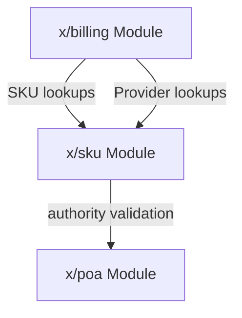
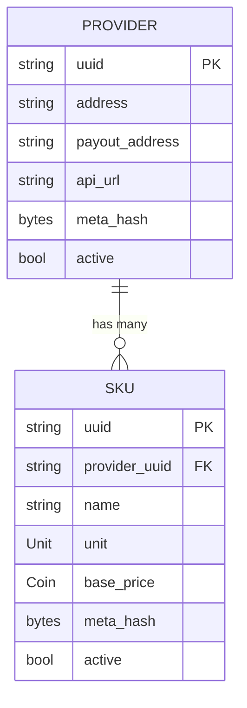
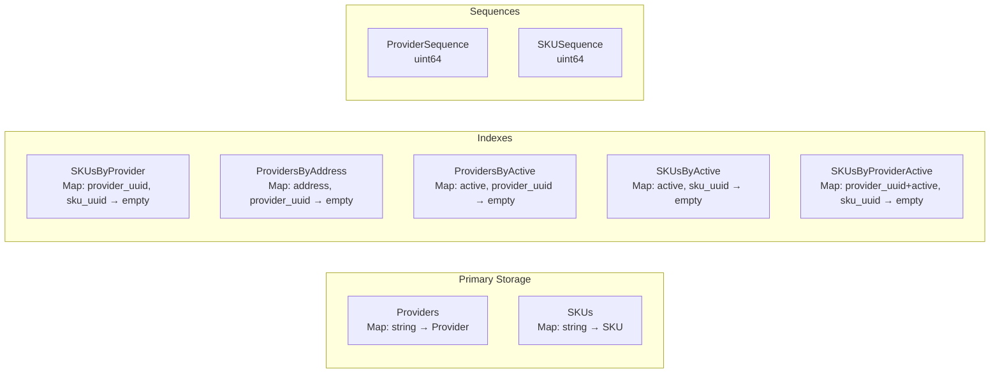
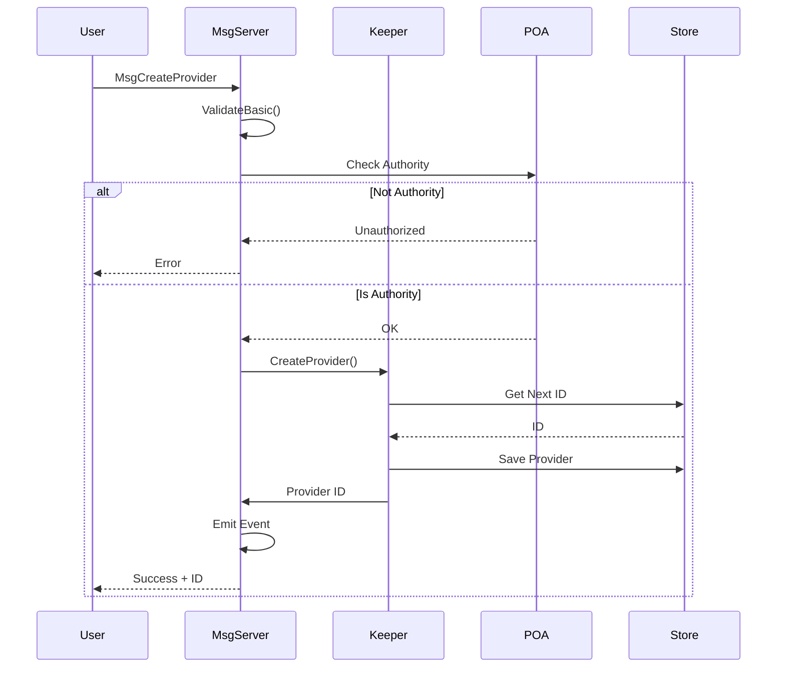
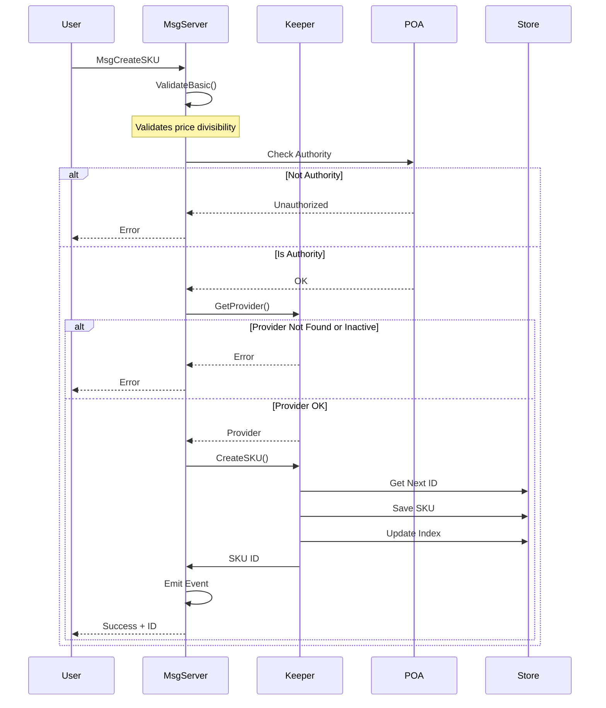
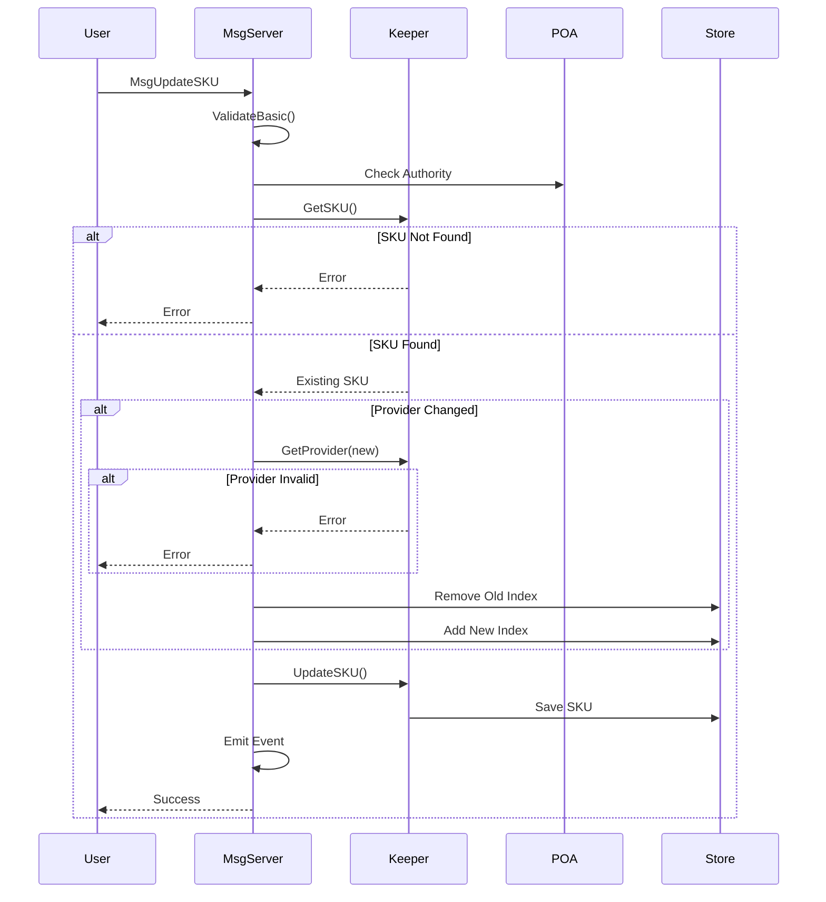

# SKU Module Architecture

This document describes the internal architecture of the x/sku module for developers who need to understand, maintain, or extend the module.

## Overview

The SKU (Stock Keeping Unit) module provides on-chain management of service offerings and their providers. It serves as the catalog layer for the billing system, defining what services are available and at what prices.

## Module Dependencies



The SKU module:
- **Depends on**: `x/poa` for authority validation
- **Depended on by**: `x/billing` for SKU and Provider information

## Data Model

### Entity Relationship Diagram



### Provider

Providers represent service vendors who offer SKUs:

| Field | Type | Description |
|-------|------|-------------|
| `uuid` | `string` | Unique UUIDv7 identifier (deterministically generated) |
| `address` | `string` | The provider's management address |
| `payout_address` | `string` | Address where billing payments are sent |
| `api_url` | `string` | HTTPS endpoint for provider's off-chain API (tenant authentication) |
| `meta_hash` | `bytes` | Optional hash of off-chain metadata (name, description, etc.) |
| `active` | `bool` | Whether provider can have new SKUs created |

### SKU

SKUs represent individual service offerings:

| Field | Type | Description |
|-------|------|-------------|
| `uuid` | `string` | Unique UUIDv7 identifier (deterministically generated) |
| `provider_uuid` | `string` | Reference to parent provider's UUID |
| `name` | `string` | Human-readable SKU name |
| `unit` | `Unit` | Billing unit (per hour, per day) |
| `base_price` | `Coin` | Price per unit (defines the payment denomination) |
| `meta_hash` | `bytes` | Optional hash of off-chain metadata |
| `active` | `bool` | Whether SKU can be used in new leases |

### Unit Enum

```
UNIT_UNSPECIFIED = 0  // Invalid
UNIT_PER_HOUR    = 1  // 3600 seconds
UNIT_PER_DAY     = 2  // 86400 seconds
```

## Module Parameters

The SKU module supports configurable parameters to control access and behavior:

| Parameter     | Type      | Description                                              |
|---------------|-----------|----------------------------------------------------------|
| `AllowedList` | `[]string`| List of user addresses permitted to perform write operations in addition to POA authority. |

### Parameter Validation

- All addresses in `AllowedList` must be valid bech32 addresses.
- No duplicate addresses are allowed.

Parameters can be updated via governance or authorized messages, and changes are emitted as `params_updated` events.

## Storage Layout

### Collections



| Collection | Key Type | Value Type | Purpose |
|------------|----------|------------|---------|
| `Params` | - | `Params` | Module parameters |
| `SKUs` | `string` (UUID) | `SKU` | Primary SKU storage |
| `SKUSequence` | - | `uint64` | Sequence counter for deterministic UUID generation |
| `SKUsByProvider` | `(string, string)` | `bool` | Index for provider → SKU lookups |
| `SKUsByActive` | `(bool, string)` | `bool` | Index for active status → SKU lookups |
| `SKUsByProviderActive` | `(string, bool, string)` | `bool` | Compound index for provider+active → SKU lookups |
| `Providers` | `string` (UUID) | `Provider` | Primary provider storage |
| `ProviderSequence` | - | `uint64` | Sequence counter for deterministic UUID generation |
| `ProvidersByAddress` | `(AccAddress, string)` | `bool` | Index for address → provider lookups |
| `ProvidersByActive` | `(bool, string)` | `bool` | Index for active status → provider lookups |

### Key Prefixes

```go
var (
    ParamsKey                    = collections.NewPrefix(0)
    SKUKey                       = collections.NewPrefix(1)
    SKUSequenceKey               = collections.NewPrefix(2)
    SKUByProviderIndexKey        = collections.NewPrefix(3)
    ProviderKey                  = collections.NewPrefix(4)
    ProviderSequenceKey          = collections.NewPrefix(5)
    ProviderByAddressIndexKey    = collections.NewPrefix(6)
    ProviderByActiveIndexKey     = collections.NewPrefix(7)
    SKUByActiveIndexKey          = collections.NewPrefix(8)
    SKUByProviderActiveIndexKey  = collections.NewPrefix(9)
)
```

### UUIDv7 Generation

The module uses deterministic UUIDv7 generation for consensus compatibility:

- **Timestamp**: Derived from block time (milliseconds)
- **Random bits**: Derived from SHA-256 hash of (block height + sequence counter)
- **Format**: Standard UUIDv7 with version 7 and variant bits set correctly

This ensures all validators generate the same UUID for the same transaction.

## Message Flow

### CreateProvider



### CreateSKU



### UpdateSKU



## Validation Rules

### Price Divisibility

SKU prices must be evenly divisible by their unit's seconds to ensure exact per-second rate calculations. See [Pricing and Exact Divisibility](../README.md#pricing-and-exact-divisibility) for the user-facing explanation.

**Implementation:**
```go
func ValidatePriceDivisibility(unit Unit, price sdk.Coin) error {
    seconds := unit.Seconds()
    if seconds == 0 {
        return ErrInvalidUnit
    }
    remainder := price.Amount.Mod(math.NewInt(seconds))
    if !remainder.IsZero() {
        return ErrPriceNotDivisible
    }
    return nil
}
```

### Provider State Validation

- Cannot create SKU for non-existent provider
- Cannot create SKU for inactive provider
- Can update SKU to reference different active provider
- Deactivating provider does not affect existing SKUs

## Events and Error Codes

For the complete reference of events and error codes, see [API Reference](API.md#events).

## Security Considerations

### Authorization Model

All write operations require either POA authority or user inclusion in the `AllowedList`:
- Only the POA admin group or users in the `AllowedList` can create/update providers
- Only the POA admin group or users in the `AllowedList` can create/update SKUs
- No other user-level SKU management is permitted

The `AllowedList` is a configurable list of user addresses permitted to perform write operations alongside the POA authority.

### Soft Delete Pattern

Both providers and SKUs use soft delete (active flag):
- Maintains referential integrity with billing module
- Historical data preserved for auditing
- Inactive items excluded from new lease creation

### Input Validation

- SKU names: Max 256 characters (`MaxSKUNameLength`)
- API URLs: Max 2048 characters (`MaxAPIURLLength`), HTTPS required
- Provider/Payout addresses: Valid bech32 addresses
- Prices: Positive, divisible by unit seconds
- Meta hash: Optional, max 64 bytes (SHA-256/SHA-512)

## Performance Characteristics

| Operation | Complexity | Notes |
|-----------|------------|-------|
| GetProvider | O(1) | Direct key lookup by UUID |
| GetProvidersByAddress | O(k) | Address index scan, k = providers for address |
| GetActiveProviders | O(k) | Active index scan, k = active providers |
| GetSKU | O(1) | Direct key lookup by UUID |
| GetSKUsByProvider | O(n) | Index scan, n = SKUs per provider |
| GetSKUsByProvider (active only) | O(k) | Compound index scan, k = active SKUs for provider |
| GetActiveSKUs | O(k) | Active index scan, k = active SKUs |
| CreateProvider | O(1) | Single write + index writes + sequence increment |
| CreateSKU | O(1) | Three writes (SKU + indexes) + sequence increment |
| UpdateSKU | O(1) | Up to 5 writes if provider or active status changes |
| UpdateProvider | O(1) | Up to 3 writes if active status changes |

### Future Improvements

The following optimizations have been identified but deferred due to marginal benefit:

| Index | Current | Improvement | Notes |
|-------|---------|-------------|-------|
| `ProviderByAddressActive` | O(k) + post-filter | O(m) direct | Compound (address, active) index for `ProviderByAddress` with `active_only=true`. Deferred because provider counts per address are typically small (1-5), making post-filtering negligible. |

## Testing Strategy

### Unit Tests
- Message validation (`msgs_test.go`)
- Type methods (`types_test.go`)
- Keeper operations (`keeper_test.go`)

### Integration Tests
- Genesis import/export
- Query handlers
- Full message flows

### E2E Tests
- Authority permissions
- Provider lifecycle
- SKU lifecycle
- Pagination
- Error conditions

### Simulation
- Random provider creation
- Random SKU creation/updates
- Weight-based operation distribution
