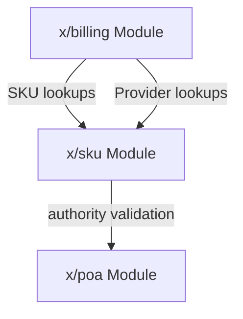
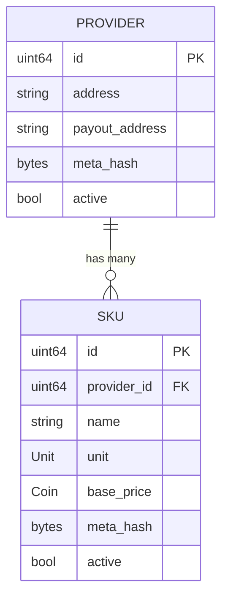
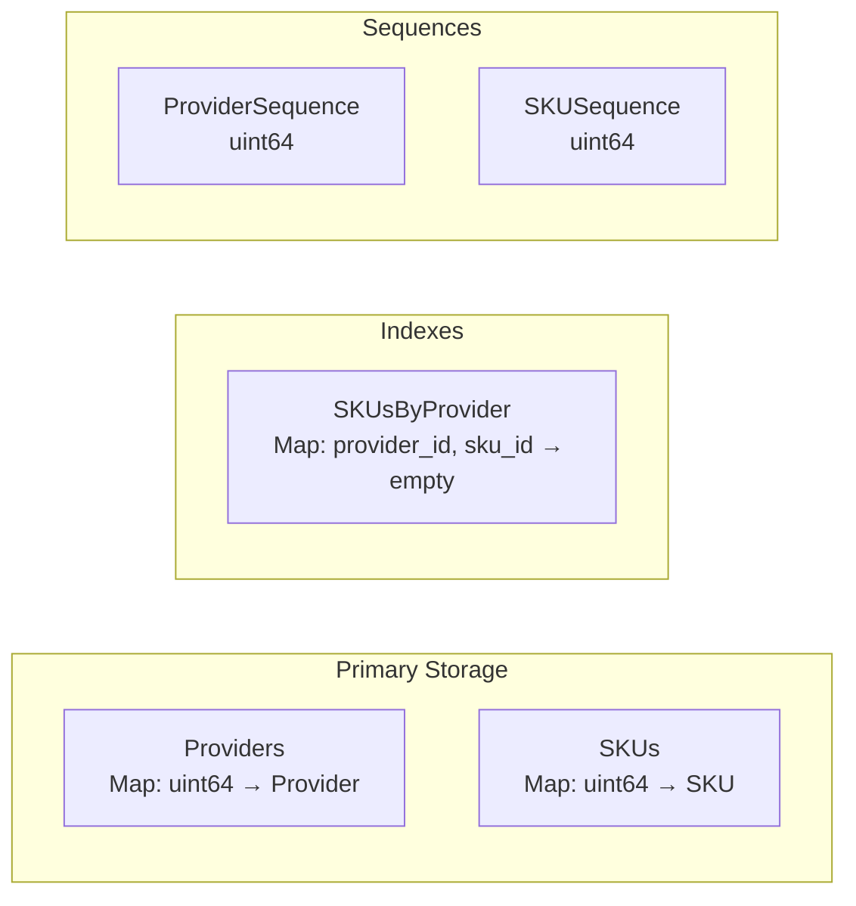
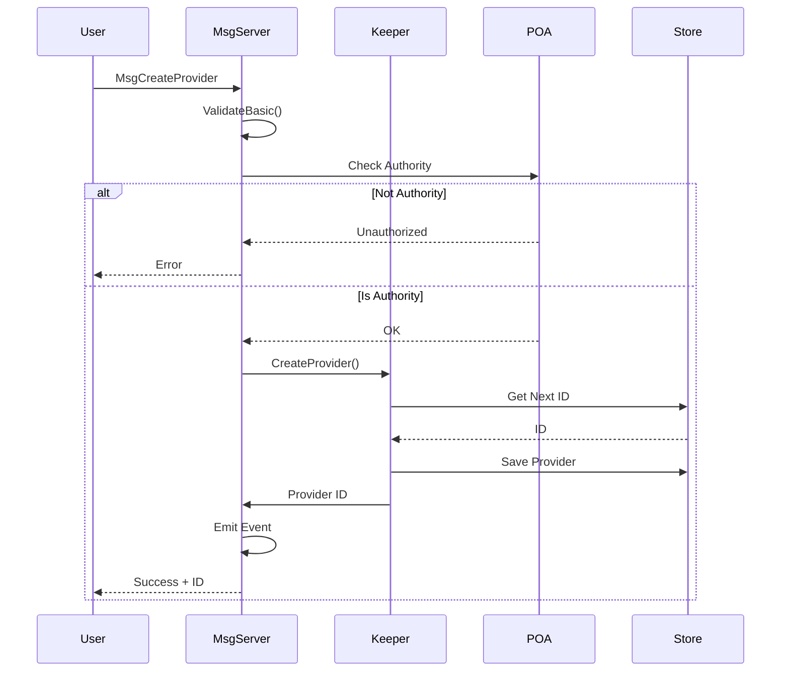
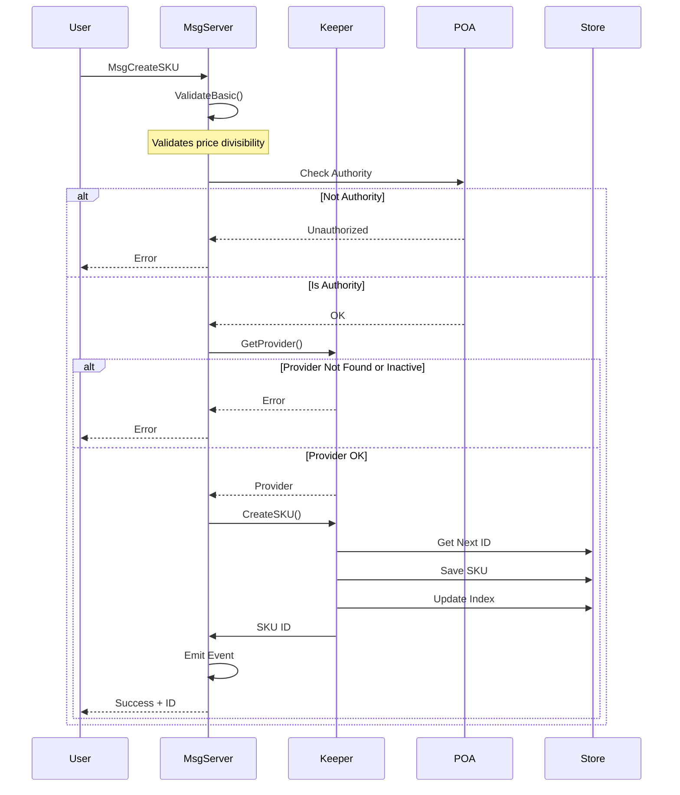
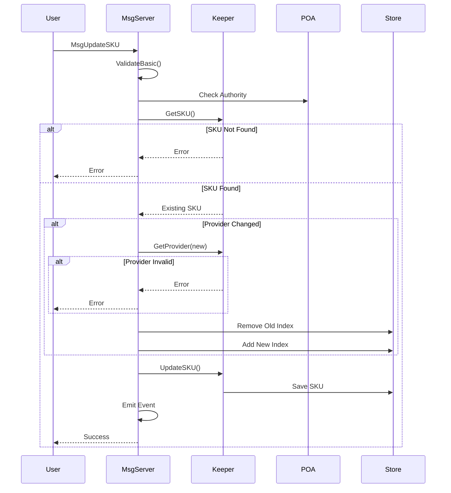

# SKU Module Architecture

This document describes the internal architecture of the x/sku module for developers who need to understand, maintain, or extend the module.

## Overview

The SKU (Stock Keeping Unit) module provides on-chain management of service offerings and their providers. It serves as the catalog layer for the billing system, defining what services are available and at what prices.

## Module Dependencies



The SKU module:
- **Depends on**: `x/poa` for authority validation
- **Depended on by**: `x/billing` for SKU and Provider information

## Data Model

### Entity Relationship Diagram



### Provider

Providers represent service vendors who offer SKUs:

| Field | Type | Description |
|-------|------|-------------|
| `id` | `uint64` | Auto-incremented unique identifier |
| `address` | `string` | The provider's management address |
| `payout_address` | `string` | Address where billing payments are sent |
| `meta_hash` | `bytes` | Optional hash of off-chain metadata (name, description, etc.) |
| `active` | `bool` | Whether provider can have new SKUs created |

### SKU

SKUs represent individual service offerings:

| Field | Type | Description |
|-------|------|-------------|
| `id` | `uint64` | Auto-incremented unique identifier |
| `provider_id` | `uint64` | Reference to parent provider |
| `name` | `string` | Human-readable SKU name |
| `unit` | `Unit` | Billing unit (per hour, per day) |
| `base_price` | `Coin` | Price per unit |
| `meta_hash` | `bytes` | Optional hash of off-chain metadata |
| `active` | `bool` | Whether SKU can be used in new leases |

### Unit Enum

```
UNIT_UNSPECIFIED = 0  // Invalid
UNIT_PER_HOUR    = 1  // 3600 seconds
UNIT_PER_DAY     = 2  // 86400 seconds
```

## Module Parameters

The SKU module supports configurable parameters to control access and behavior:

| Parameter     | Type      | Description                                              |
|---------------|-----------|----------------------------------------------------------|
| `AllowedList` | `[]string`| List of user addresses permitted to perform write operations in addition to POA authority. |

### Parameter Validation

- All addresses in `AllowedList` must be valid bech32 addresses.
- No duplicate addresses are allowed.

Parameters can be updated via governance or authorized messages, and changes are emitted as `params_updated` events.

## Storage Layout

### Collections



| Collection | Key Type | Value Type | Purpose |
|------------|----------|------------|---------|
| `Providers` | `uint64` | `Provider` | Primary provider storage |
| `ProviderSequence` | - | `uint64` | Auto-increment for provider IDs |
| `SKUs` | `uint64` | `SKU` | Primary SKU storage |
| `SKUSequence` | - | `uint64` | Auto-increment for SKU IDs |
| `SKUsByProvider` | `(uint64, uint64)` | `bool` | Index for provider → SKU lookups |

### Key Prefixes

```go
var (
    ProvidersKeyPrefix         = collections.NewPrefix(0)
    ProviderSequenceKeyPrefix  = collections.NewPrefix(1)
    SKUsKeyPrefix              = collections.NewPrefix(2)
    SKUSequenceKeyPrefix       = collections.NewPrefix(3)
    SKUsByProviderKeyPrefix    = collections.NewPrefix(4)
)
```

## Message Flow

### CreateProvider



### CreateSKU



### UpdateSKU



## Validation Rules

### Price Divisibility

SKU prices must be evenly divisible by their unit's seconds to ensure exact per-second rate calculations:

```go
func ValidatePriceDivisibility(unit Unit, price sdk.Coin) error {
    seconds := unit.Seconds()
    if seconds == 0 {
        return ErrInvalidUnit
    }
    
    // Check: price.Amount % seconds == 0
    remainder := price.Amount.Mod(math.NewInt(seconds))
    if !remainder.IsZero() {
        return ErrPriceNotDivisible
    }
    return nil
}
```

**Valid Examples:**
- 3600upwr per hour (3600 / 3600 = 1 per second)
- 86400upwr per day (86400 / 86400 = 1 per second)

**Invalid Examples:**
- 100upwr per hour (100 / 3600 ≠ integer)
- 3601upwr per hour (3601 / 3600 ≠ integer)

### Provider State Validation

- Cannot create SKU for non-existent provider
- Cannot create SKU for inactive provider
- Can update SKU to reference different active provider
- Deactivating provider does not affect existing SKUs

## Events

| Event | Attributes | When Emitted |
|-------|------------|--------------|
| `provider_created` | `provider_id`, `address`, `payout_address` | Provider created |
| `provider_updated` | `provider_id` | Provider updated |
| `provider_activated` | `provider_id` | Provider reactivated via update |
| `provider_deactivated` | `provider_id` | Provider deactivated |
| `sku_created` | `sku_id`, `provider_id`, `name` | SKU created |
| `sku_updated` | `sku_id`, `provider_id` | SKU updated |
| `sku_activated` | `sku_id`, `provider_id` | SKU reactivated via update |
| `sku_deactivated` | `sku_id`, `provider_id` | SKU deactivated |
| `params_updated` | - | Module parameters updated |

## Error Codes

| Error | Code | Description |
|-------|------|-------------|
| `ErrInvalidSKU` | 2 | SKU validation failed |
| `ErrSKUNotFound` | 3 | SKU does not exist |
| `ErrUnauthorized` | 4 | Sender not authority |
| `ErrInvalidProvider` | 5 | Provider validation failed |
| `ErrProviderNotFound` | 6 | Provider does not exist |
| `ErrProviderInactive` | 7 | Provider is not active |

## Security Considerations

### Authorization Model

All write operations require either POA authority or user inclusion in the `AllowedList`:
- Only the POA admin group or users in the `AllowedList` can create/update providers
- Only the POA admin group or users in the `AllowedList` can create/update SKUs
- No other user-level SKU management is permitted

The `AllowedList` is a configurable list of user addresses permitted to perform write operations alongside the POA authority.

### Soft Delete Pattern

Both providers and SKUs use soft delete (active flag):
- Maintains referential integrity with billing module
- Historical data preserved for auditing
- Inactive items excluded from new lease creation

### Input Validation

- Provider names: Max 256 characters
- SKU names: Max 256 characters
- Payout addresses: Valid bech32 addresses
- Prices: Positive, divisible by unit seconds
- Meta hash: Optional, max 64 bytes (SHA-256/SHA-512)

## Performance Characteristics

| Operation | Complexity | Notes |
|-----------|------------|-------|
| GetProvider | O(1) | Direct key lookup |
| GetSKU | O(1) | Direct key lookup |
| GetSKUsByProvider | O(n) | Index scan, n = SKUs per provider |
| CreateProvider | O(1) | Single write |
| CreateSKU | O(1) | Two writes (SKU + index) |
| UpdateSKU | O(1) | Up to 3 writes if provider changes |

## Testing Strategy

### Unit Tests
- Message validation (`msgs_test.go`)
- Type methods (`types_test.go`)
- Keeper operations (`keeper_test.go`)

### Integration Tests
- Genesis import/export
- Query handlers
- Full message flows

### E2E Tests
- Authority permissions
- Provider lifecycle
- SKU lifecycle
- Pagination
- Error conditions

### Simulation
- Random provider creation
- Random SKU creation/updates
- Weight-based operation distribution
